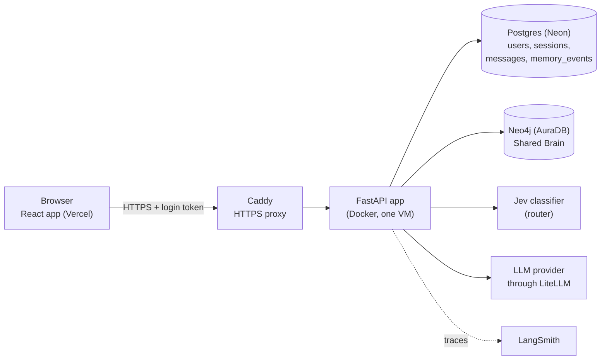
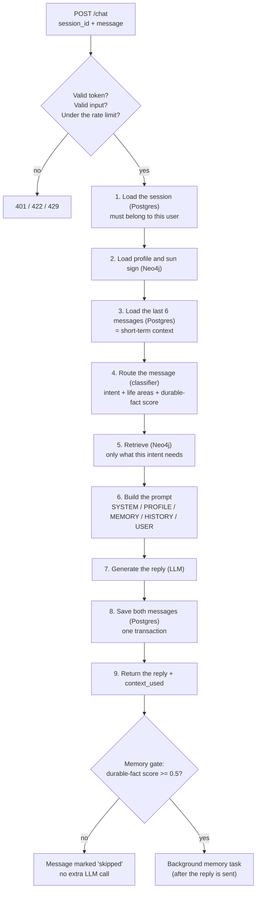
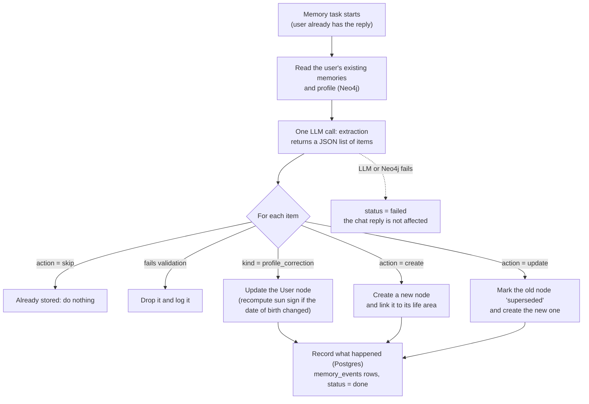
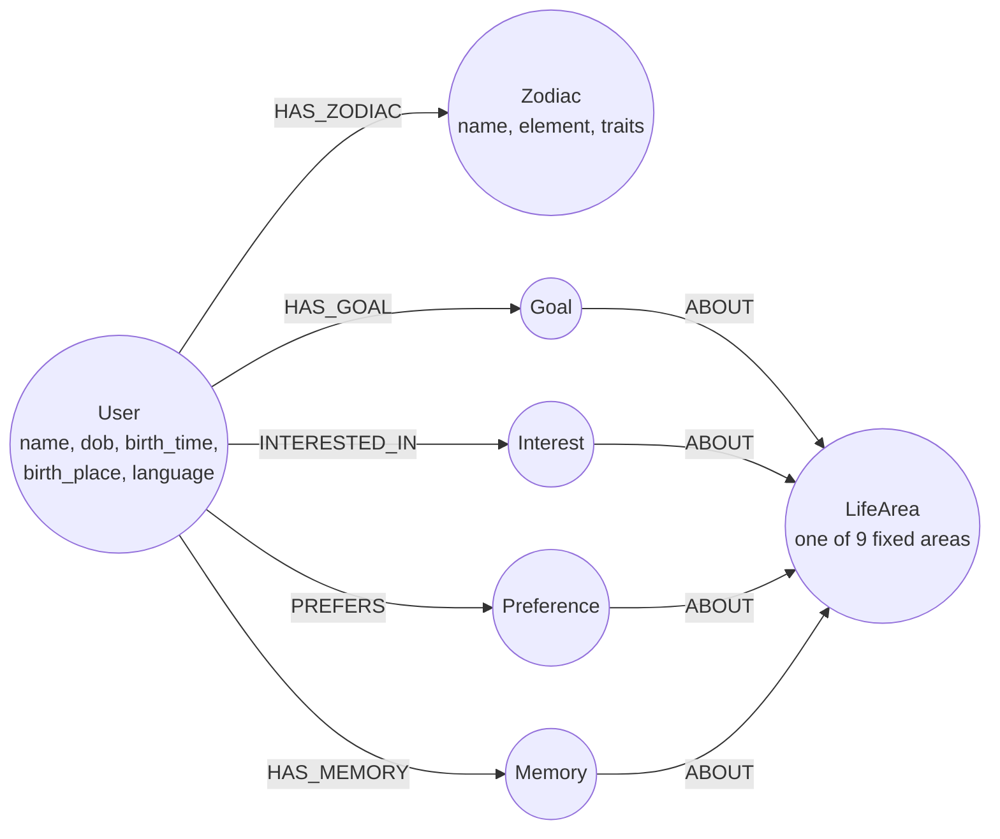
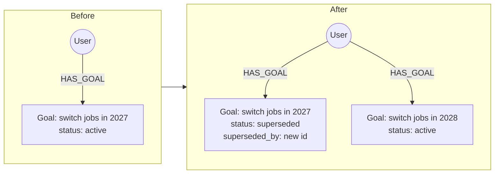
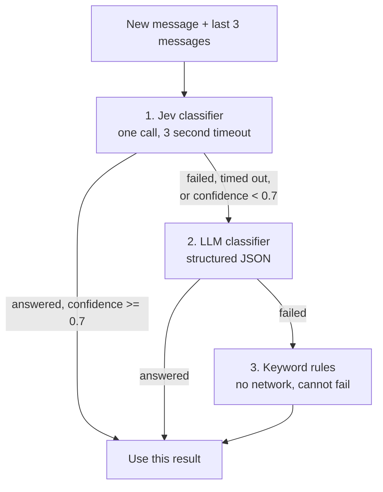

# MyNaksh: Personalized Astrology Chat with a Shared Brain

A chat service that remembers what matters about each user and uses it to personalize answers.

- **Short-term context** is the recent messages of the current chat. It lives in Postgres.
- **Long-term memory** is the *Shared Brain*: a graph of each user's profile, goals, interests, preferences and important memories. It lives in Neo4j.
- For every message the system decides what kind of message it is, picks only the relevant context, calls the LLM, replies, and then updates the Shared Brain in the background.

**Live app:** https://mynaksh-assignment.vercel.app (sign up with any email and password; no email is sent)

| Detailed document | What is in it |
|---|---|
| [docs/testing-and-evaluation.md](docs/testing-and-evaluation.md) | Every test scenario with example, expected and actual result; how to evaluate the Shared Brain |
| [docs/error-handling.md](docs/error-handling.md) | Every failure case, what the user sees, and the test that proves it |
| [docs/api-samples.md](docs/api-samples.md) | A real request and response for every endpoint |
| [docs/design-decisions.md](docs/design-decisions.md) | Every design decision: what was chosen, what was rejected and why; the scaling plan |

## Contents

1. [Try it in two minutes](#1-try-it-in-two-minutes)
2. [Architecture](#2-architecture)
3. [One conversation, step by step](#3-one-conversation-step-by-step)
4. [Data design](#4-data-design)
5. [Shared Brain schema](#5-shared-brain-schema)
6. [Memory strategy](#6-memory-strategy)
7. [Context selection](#7-context-selection)
8. [LLM layer](#8-llm-layer)
9. [Key design decisions and trade-offs](#9-key-design-decisions-and-trade-offs)
10. [Production considerations](#10-production-considerations)
11. [Testing and evaluation](#11-testing-and-evaluation)
12. [Error handling](#12-error-handling)
13. [Bonus items](#13-bonus-items)
14. [Setup and running](#14-setup-and-running)
15. [API overview](#15-api-overview)

---

## 1. Try it in two minutes

1. Open the live app and sign up.
2. Fill in the short birth-details form (name, date, time and place of birth).
3. In the chat, send: `I'm planning to switch jobs next year.`
   A "Memory updated" chip appears under your message after a second or two.
4. Send: `What should I focus on for my career?` The answer uses the goal.
5. Send: `Why do you say that?` The answer explains the previous reply.
6. Click **New chat** and send: `What do you remember about my career goals?`
   The goal comes back, although this chat has no history.
7. Open the **Memory** page to see, and delete, what is stored about you.

## 2. Architecture

### 2.1 Components



| Part | Technology | Job |
|---|---|---|
| API | Python 3.13, FastAPI, Pydantic | All endpoints, the chat pipeline, the memory task |
| Relational store | Postgres, SQLAlchemy (async), Alembic | Accounts, chat sessions, messages, the memory audit log |
| Graph store | Neo4j | The Shared Brain |
| Router | TypeSafe AI Jev, with an LLM and keyword rules as fallbacks | Decides the intent, the life areas and whether the message holds a lasting fact |
| LLM | Any provider through LiteLLM | Writes the reply; extracts memories |
| Frontend | React, Vite, TypeScript, Material UI | Login, onboarding, chat, memory page, profile page |
| Tracing | LangSmith | One trace per chat turn with every step inside it |

### 2.2 Code layout

```
backend/app/
├── api/         HTTP routes (auth, users, sessions, chat, memory, health, rate limit)
├── auth/        password hashing, login tokens, the "current user" dependency
├── chat/        the pipeline, the per-intent retrievers, the prompt builder
├── classifier/  Jev, LLM classifier, keyword rules, and the fallback chain
├── llm/         the LLM interface, the LiteLLM provider, the fake LLM for tests
├── memory/      the background memory task and the extraction prompt
├── brain/       Neo4j: schema setup, profile repository, memory repository
├── profile/     sun-sign stub, validation, profile service
├── db/          Postgres: models and one repository class per table
├── models/      request and response shapes
└── config.py    every setting and feature flag, read from the environment
backend/tests/   175 automated tests
frontend/        the React app and 70 browser tests (frontend/e2e)
```

### 2.3 The chat request flow

`POST /chat` runs these steps in order. They are plain async functions that read and write one `TurnState` object. There is no agent framework.



The reply never waits for memory work. The frontend asks `GET /messages/{id}/memory-updates` once a second, for up to 8 seconds, to show the "Memory updated" chip.

### 2.4 The background memory flow



## 3. One conversation, step by step

This is the example from the assignment, run against the application. The responses below are real (shortened where marked).

**Setup.** Rahul signed up and filled the form: born 15 August 1995, 14:30, Delhi. The sun-sign stub computed Leo.

### Turn 1: a lasting fact

> **User:** I'm planning to switch jobs next year.

| Step | What happened |
|---|---|
| Route | intent `general`, area `career`, durable-fact score above 0.5 |
| Retrieve | No memories exist yet |
| Prompt | Profile + sun sign. No history yet (first message) |
| Reply | Career guidance in a Leo flavour |
| `context_used` | `["user_profile", "zodiac"]` |
| Memory gate | Open, so the background task runs |

One second later the poll returns:

```json
{
  "status": "done",
  "updates": [
    { "action": "created", "kind": "goal", "title": "Job switch next year",
      "life_area": "career", "memory_id": "13201797-1284-44ee-a88a-453f563fdd2b" }
  ]
}
```

The Shared Brain now holds this (note that "next year" was turned into a real year):

```
(Rahul:User)-[:HAS_ZODIAC]->(Leo:Zodiac)
(Rahul:User)-[:HAS_GOAL]->(:Goal {
    text: "Career goal: plans to switch jobs in 2027.",
    attributes: {target_year: 2027}, confidence, importance, status: "active"
})-[:ABOUT]->(career:LifeArea)
```

### Turn 2: the memory is used

> **User:** What should I focus on for my career?

| Step | What happened |
|---|---|
| Route | intent `general`, area `career`, durable-fact score below 0.5 |
| Retrieve | Active memories linked to `career`: the goal |
| Reply | "...For your job switch in 2027, prepare a simple 'spotlight pitch'..." |
| `context_used` | `["user_profile", "zodiac", "history", "goal:13201797-..."]` |
| Memory gate | Closed. The message is marked `skipped`; no extraction call is made |

### Turn 3: a follow-up

> **User:** Why do you say that?

| Step | What happened |
|---|---|
| Route | intent `followup` |
| Retrieve | No new search. It reuses exactly the memories the previous reply used |
| Reply | "I'm saying that because ... since you're planning a job switch next year ..." |
| `context_used` | `["user_profile", "zodiac", "history", "goal:13201797-..."]` |

### Turn 4: a new chat

> **User (new session):** What do you remember about my career goals?

| Step | What happened |
|---|---|
| Route | intent `memory_query`, area `career` |
| Retrieve | Everything active in `career`, newest first. History is empty (new session) |
| Reply | "You've told me that your career goal is to switch jobs in 2027. That's the only career-goal detail I have saved so far." |
| `context_used` | `["user_profile", "zodiac", "goal:13201797-..."]` (no `history`) |

### Turn 5: a correction

> **User:** Actually, I've pushed the job switch to 2028.

The extraction step sees the existing goal with its id and returns `action: "update"`. The old node is marked `superseded` and a new node takes its place:

```json
{ "status": "done",
  "updates": [ { "action": "updated", "kind": "goal", "title": "Job switch timing updated",
                 "life_area": "career", "memory_id": "402dabe9-61a8-4633-8959-dedc71006bc1" } ] }
```

Asking again now returns: "you're planning to switch jobs in 2028. That's the only career-goal detail I have saved so far." The 2027 version is never selected again.

### An unrelated question

> **User:** Any advice for my health this month?

The router returns area `health`. Nothing is stored under health, so the career goal is **not** sent to the LLM: `context_used` is `["user_profile", "zodiac", "history"]`.

## 4. Data design

### 4.1 Two stores, split by the kind of data

| Data | Store | Why |
|---|---|---|
| Accounts, password hashes | Postgres | Needs unique emails and reliable transactions |
| Chat sessions and messages (short-term context) | Postgres | An ordered log, read by "last N of this session" |
| Memory audit log (`memory_events`) | Postgres | Append-only records, read by message id |
| Profile, sun sign, goals, interests, preferences, memories, life areas | Neo4j | Connected facts about one person, read by following relationships |

The rule: **Postgres holds what happened; Neo4j holds what we know about the user.**

### 4.2 Postgres tables

| Table | Main columns | Notes |
|---|---|---|
| `users` | `id`, `email` (unique, lower-cased), `password_hash`, `profile_complete` | `id` is reused as the Neo4j `User.id` |
| `sessions` | `id`, `user_id`, `title`, `updated_at` | Title comes from the first message (60 characters) |
| `messages` | `id`, `session_id`, `user_id`, `role`, `content`, `context_used`, `used_memory_ids`, `route_intent`, `route_areas`, `memory_status` | Assistant rows record what context was used. User rows record what the memory step did: `pending`, `done`, `skipped` or `failed` |
| `memory_events` | `message_id`, `action`, `memory_id`, `kind`, `title`, `life_area` | One row per memory write. The polling endpoint reads this table only |

The schema is created by an Alembic migration, not by `create_all`.

### 4.3 Rules across the two stores

There is no transaction that spans Postgres and Neo4j, so the order of writes is fixed and each failure has a planned outcome.

| Operation | Write order | If the second write fails |
|---|---|---|
| Signup | 1. Postgres user row. 2. Neo4j `User` node with the same id | The Postgres row is deleted again (a compensating action) and the user sees "please try again" |
| Saving the profile form | 1. Neo4j profile and sun-sign link. 2. Postgres `profile_complete` flag | The request fails and the user retries. The Neo4j write is safe to repeat |
| Chat turn | Both messages in one Postgres transaction | Nothing is half-saved |
| Memory update | 1. Neo4j nodes. 2. Postgres `memory_events` + status `done` | The memory exists but its audit row does not. The message is marked `failed` and an `INCONSISTENCY` line with the memory ids is logged |

Memory writes are **best-effort**: they can fail without ever affecting the reply the user already received.

## 5. Shared Brain schema

### 5.1 The graph



### 5.2 Entities

| Node | What it holds | Example |
|---|---|---|
| `User` | The profile: name, date of birth, birth time (and whether it is known), birth place, language | Rahul, 1995-08-15, Delhi |
| `Zodiac` | The 12 signs with element and traits. Seeded at startup | Leo, Fire, confident / generous / expressive |
| `LifeArea` | A fixed list of 9 areas. Seeded at startup | career, finance, relationships, family, health, education, spirituality, travel, general |
| `Goal` | Something the user wants to do | "Career goal: plans to switch jobs in 2027." |
| `Interest` | Something the user is interested in | "Interested in entrepreneurship." |
| `Preference` | How the user likes things | "Prefers short, direct answers." |
| `Memory` | A fact or a significant life event | "Got married in 2022." |

Every `Goal`, `Interest`, `Preference` and `Memory` node has the same properties:

| Property | Meaning |
|---|---|
| `id` | Unique id |
| `title` | A few words, shown in the UI |
| `text` | One clean sentence. This is what the LLM is shown |
| `attributes` | Extra details such as `target_year: 2027` |
| `confidence` | 0 to 1: how clearly the user stated it |
| `importance` | 0 to 1: how much it matters for future guidance |
| `status` | `active` or `superseded` |
| `superseded_by` | The id of the node that replaced this one |
| `created_at`, `updated_at` | Timestamps |
| `source_session_id`, `source_message_id` | Which message it came from (ids in Postgres) |

### 5.3 Relationships

| Relationship | From → to | Meaning |
|---|---|---|
| `HAS_ZODIAC` | User → Zodiac | The user's sun sign. Exactly one; it moves when the date of birth changes |
| `HAS_GOAL` | User → Goal | |
| `INTERESTED_IN` | User → Interest | |
| `PREFERS` | User → Preference | |
| `HAS_MEMORY` | User → Memory | |
| `ABOUT` | any memory node → LifeArea | The life area the memory belongs to. **This is the retrieval key** |

### 5.4 How information is retrieved

Every query starts at the user's own node, so one user can never reach another user's data. The main query follows two relationships:

```cypher
MATCH (u:User {id: $user_id})-[:HAS_GOAL|INTERESTED_IN|PREFERS|HAS_MEMORY]->(m)-[:ABOUT]->(area:LifeArea)
WHERE m.status = 'active' AND area.name IN $areas
RETURN m
```

In words: "this user's active memories about these life areas". The router supplies `$areas`.

### 5.5 Why a graph

- The assignment's own examples (`User ─ HAS_GOAL → Career Change`) are already a graph. The stored shape matches how the data is described.
- The profile, the sun sign and the memories are all one hop from the user, and the life area is one more hop. The retrieval query is one short pattern.
- New kinds of facts or links (for example a goal linked to a person, or a memory linked to two life areas) can be added without changing tables.
- Life areas and zodiac signs are shared nodes. Because of that, the same nine names are used when storing and when searching, so they cannot drift apart.

## 6. Memory strategy

### 6.1 Short-term versus long-term

| | Short-term context | Long-term memory |
|---|---|---|
| What | The last 6 messages of the current session | Profile, goals, interests, preferences, memories |
| Where | Postgres `messages` | Neo4j Shared Brain |
| Lifetime | One chat session | Until the user changes or deletes it |
| Used for | "Why do you say that?" | "What do you remember about my career goals?" |
| Crosses sessions | Never | Always |

### 6.2 What is remembered, and what is not

| Stored | Not stored |
|---|---|
| Stable facts about the user | Greetings and thanks |
| Goals | Questions |
| Preferences | Passing moods |
| Interests | Anything the assistant said or predicted |
| Significant life events | A fact that is already stored with the same meaning |

### 6.3 Two filters before anything is stored

Not every message becomes a memory. A message passes two filters:

1. **The gate (cheap, during the chat turn).** The router already returns a score from 0 to 1 for "this message states a lasting personal fact, goal, preference or life event". Below 0.5 the message is marked `skipped` and no extraction call is made. Most messages stop here, which saves one LLM call per message.
2. **Extraction (one LLM call, in the background).** The LLM sees the new message, the two messages before it, the user's current profile and all existing memories with their ids. It returns a JSON list. Each item is one of:

| Action | When | Effect |
|---|---|---|
| `create` | A new fact | A new node, linked to the user and to its life area |
| `update` | The user changed or corrected an existing memory | The old node is marked `superseded`; a new node replaces it |
| `skip` | Already stored with the same meaning | Nothing |

Today's date is given to the extraction prompt, so "next year" is stored as `2027` and not as the words "next year".

### 6.4 The LLM's output is never trusted

Every extracted item is checked before it is applied. An item is dropped (and logged) when:

- its life area is not one of the nine,
- its title or text is empty,
- its confidence or importance is outside 0 to 1,
- it tries to update a memory id that is not one of this user's active memories,
- it is a profile correction with an invalid date or time.

One bad item does not stop the valid items in the same reply from being applied.

### 6.5 Updating existing memories

**Supersede, do not overwrite.** When the user says "Actually, I've pushed the job switch to 2028":



The old node stays as history but is never selected again. Both changes happen in one Neo4j transaction.

**Profile corrections.** When the user states or corrects their name, date of birth, birth time or birth place in chat, the `User` node is updated directly:

- A new date of birth goes through the same validation as the form (1900-01-01 up to today), and the sun-sign link is recomputed.
- A birth time also sets `birth_time_known` to true.
- When name, date of birth and birth place are all known, the profile counts as complete, even if the form was never filled.

This is how the assignment's first message ("My name is Rahul. I was born on 15 August 1995 in Delhi. I'm planning to switch jobs next year.") works for a brand-new user: it produces three profile updates and one goal.

**Deleting.** The user can delete any memory from the Memory page. It is removed from Neo4j for good. Deleting a memory does not bring back the one it replaced.

## 7. Context selection

The system never sends the whole graph or the whole conversation to the LLM. Selection happens in two steps: **understand the message**, then **retrieve for that kind of message**.

### 7.1 Understanding the message (the router)

The router returns one result per message:

| Field | Meaning | Example |
|---|---|---|
| `intent` | One of five kinds of message | `general` |
| `intent_confidence` | 0 to 1 | 0.93 |
| `areas` | Which of the nine life areas the message is about | `["career"]` |
| `has_durable_fact` | 0 to 1, used by the memory gate | 0.12 |

The five intents:

| Intent | Meaning | Example |
|---|---|---|
| `general` | A question about the user's life, or a statement sharing something | "What should I focus on for my career?" |
| `followup` | Only makes sense together with the previous reply | "Why do you say that?" |
| `memory_query` | Asks what the assistant remembers | "What do you remember about my career goals?" |
| `profile_query` | Asks about the user's own profile | "What is my zodiac sign?" |
| `smalltalk` | A greeting or thanks | "Thanks!" |

### 7.2 The fallback chain



- **Jev** is a small model built for classification. In one call it answers one multiple-choice question (the intent) and nine yes/no questions (eight life areas and the durable-fact score), each with a calibrated probability.
- The **LLM classifier** asks the main LLM the same questions and gets validated JSON back. Areas the LLM invents are dropped.
- The **keyword rules** are the last resort. Rules cannot judge whether a fact is worth keeping, so they leave the memory gate open and let the extraction step decide.

All three sit behind one interface (`Classifier`), so the pipeline does not know which one answered.

### 7.3 Retrieval by intent

Each intent has its own small retriever function. It decides what goes into the prompt.

| Intent | Profile | Memories | History |
|---|---|---|---|
| `general` | Full profile, sun sign with element and traits | The top 5 active memories in the routed life areas, ranked | Last 6 messages |
| `followup` | Same as general | Exactly the memories the previous reply used. No new search | Last 6 messages |
| `memory_query` | Profile facts and sign name, no astrology flavour | All active memories in the asked areas (or all of them), newest first | Last 6 messages |
| `profile_query` | Full profile and sun sign | None | Last 6 messages |
| `smalltalk` | Name only | None | Last 2 messages |

Two built-in fallbacks:

- A `general` question with no specific area and nothing stored under `general` gets the 3 most important memories from any area.
- A `followup` with nothing to follow (first message, or the last reply used no memories) is handled as `general`.

### 7.4 Ranking

For `general` questions, memories in the matching areas are ranked by:

```
score = confidence × importance × e^(−days since last update / 90)
```

Example with three career memories and room for two:

| Memory | Confidence | Importance | Age | Score | Selected |
|---|---|---|---|---|---|
| Plans to switch jobs in 2027 | 0.9 | 0.8 | today | 0.72 | Yes |
| Wants to move into management | 0.8 | 0.7 | 30 days | 0.40 | Yes |
| Was considering an MBA | 0.9 | 0.8 | 180 days | 0.10 | No |

An old memory fades but is never deleted by the ranking; it can still be listed by a `memory_query`.

### 7.5 The prompt, and `context_used`

The prompt is built from labeled blocks. An empty block is left out.

```
[SYSTEM]   persona, today's date, rules
[PROFILE]  Name: Rahul
           Date of birth: 1995-08-15
           Birth place: Delhi
           Birth time: 14:30
           Sun sign: Leo (Fire) - traits: confident, generous, expressive
[MEMORY]   - goal (career): Career goal: plans to switch jobs in 2027. (stated today)
[HISTORY]  user: I'm planning to switch jobs next year.
           assistant: ...
[USER]     What should I focus on for my career?
```

The rules in the system block include: use facts only when relevant; never invent facts about the user; do not guess a sun sign that was not given; do not give timing that needs an unknown birth time; do not claim planetary positions or charts.

`context_used` in the response is filled at the same moment each block is added to the prompt. It therefore lists exactly what was sent, not what could have been sent. A memory appears as `kind:id`, for example `goal:13201797-...`.

## 8. LLM layer

The application depends on one small interface:

```python
class LLMProvider(Protocol):
    async def generate(self, messages: list[dict]) -> str: ...
    async def generate_json(self, messages: list[dict], schema: type[SchemaT]) -> SchemaT: ...
```

- `LiteLLMProvider` implements it. The provider is chosen by two settings, `PRIMARY_MODEL` and `FALLBACK_MODEL` (for example `openai/<model>` or `gemini/<model>`), plus that provider's API key. **Changing provider needs no code change.**
- Each model is retried twice, then the fallback model is tried. If every model fails, the chat still answers with a friendly message (see [Error handling](#12-error-handling)).
- `generate_json` validates the model's JSON against a Pydantic schema. Invalid JSON counts as a failure of that model.
- `FakeLLM` implements the same interface for tests. It records every prompt it receives, so tests can assert on what was sent to the LLM.

## 9. Key design decisions and trade-offs

The decisions below are the ones that shape the logical flow of the application. The full record, including hosting, data storage, auth, feature flags and a scaling plan, is in [docs/design-decisions.md](docs/design-decisions.md).

The guiding idea: a small system that can be explained line by line.

### 9.1 Shared Brain graph schema

**Chosen:** a `User` node with the profile as properties; shared `Zodiac` and `LifeArea` nodes; four memory labels (`Goal`, `Interest`, `Preference`, `Memory`) with one shared set of properties, each linked `ABOUT` one life area. The schema was designed from the question the brain must answer ("what do we know about this user in this life area?"), not from the data.

| Decision | Chosen | Rejected | Why |
|---|---|---|---|
| Life areas | Shared hub nodes, a fixed list of 9 | Free-text labels from the LLM | The same closed list is used for storing and retrieving, so the two always match. Retrieval by area is one hop |
| Memory types | 4 labels + 4 relationship types, one property set | One generic `Fact` node | Readable Cypher that mirrors the assignment's examples; uniform code |
| Profile fields | Properties on `User` | Separate nodes | One-to-one facts that nothing else links to |
| Corrections | Supersede (`status` + `superseded_by`) | Overwrite | Keeps history; a fact is never silently lost |
| Chat history | In Postgres | `Session` and `Message` nodes | A time-ordered log is not graph-shaped |

**Trade-off:** two databases mean no shared transaction. This is handled with a fixed write order, a compensating delete at signup, and best-effort memory writes (section 4.3).

### 9.2 Short-term memory

| Option | Verdict | Why |
|---|---|---|
| The last 6 messages, word for word | Chosen | "Why do you say that?" needs the assistant's exact previous claim |
| A rolling summary only | Rejected | Loses the wording, drifts over time, and costs an extra LLM call every turn |
| A summary of older turns + recent turns word for word | Later | The right answer once sessions are long enough to strain the token budget |

**Trade-off:** in a very long session, anything older than 6 messages is forgotten unless it was stored as a memory.

### 9.3 Context selection

**Chosen:** a router classifies each message into an intent and life areas; each intent has its own retrieval rule; general questions rank memories by confidence × importance × recency and keep the top 5.

| Option | Verdict | Why |
|---|---|---|
| A classifier router + retrieval per intent | Chosen | Predictable, testable and explainable. One cheap call decides the intent, the areas and the memory gate |
| Keyword rules only | Last-resort fallback | Instant, but misses indirect phrasing |
| Embeddings (ranking by similarity) | Not built | Would find memories across areas, but needs tuning, is harder to explain, and similar is not the same as relevant |

- Follow-ups reuse the previous answer's memories, because an explanation must rest on the same facts the answer used.
- `context_used` is returned on every response, for debugging and so tests can assert that irrelevant memories stayed out.

**Trade-off:** a memory filed under one area is not found by a question routed to another (a home loan, filed under finance, for "should I quit my job?"). Area filtering was chosen first because it is exact and enough for tens of memories per user; embeddings are the planned next step for hundreds.

### 9.4 Classifier provider

**Chosen:** Jev (TypeSafe) as the primary router, then the LLM, then keyword rules, all behind one `Classifier` interface.

| Option | Verdict | Why |
|---|---|---|
| Jev | Primary | Very cheap and fast. Its calibrated confidence decides when to fall back. It cannot return an option that was not offered |
| LLM router | Fallback | Strong understanding, but slower and costlier per message |
| OpenAI Decisions API | Alternative | The same idea; it would fit behind the same interface |
| Keyword rules | Last resort | Keep the chat working when both providers fail |

**Trade-off:** Jev is a new service from one vendor, hosted far from India. The version is pinned (`jev-1.13.0`), the timeout is 3 seconds, and the fallback chain covers an outage.

### 9.5 Orchestration

| Option | Verdict | Why |
|---|---|---|
| Plain async Python: step functions over one `TurnState` object | Chosen | The flow is short and fixed. Our code, not the LLM, picks each step. Every line can be explained |
| LangGraph | Rejected for now | Its strengths (agent loops, pause and resume, human-in-the-loop) are not needed, and its memory stores would overlap with the Shared Brain |
| CrewAI, AutoGen, OpenAI Agents SDK | Rejected | Built for multi-agent setups, or tied to one provider |

**Trade-off:** no built-in checkpointing or tool loop. LangGraph would earn its place with tool-using features (transits, booking an astrologer) or resumable runs. Because each step is already a function over one state object, moving later means wrapping functions as nodes, not rewriting logic.

### 9.6 LLM layer

| Option | Verdict | Why |
|---|---|---|
| Our own `LLMProvider` interface, implemented with LiteLLM, with a primary and a fallback model | Chosen | Switching provider means changing environment values. Tests use a `FakeLLM` behind the same interface |
| One provider wired in directly | Rejected | The assignment asks for a provider that can be swapped |
| LangChain chat models | Rejected | Only worth it together with LangGraph |

This was tested for real: development began on Gemini and the deployment moved to OpenAI by editing two settings.

**Trade-off:** one more dependency, and provider-specific features are limited to what the common interface exposes.

### 9.7 Memory update and user experience

| Option | Verdict | Why |
|---|---|---|
| Extraction in a background task, after the reply | Chosen | The user never waits for it. It maps directly onto queue workers later |
| Extraction inside the request | Rejected | Every reply would wait for an extra LLM call |
| A gate before extraction | Chosen | Most messages (questions, thanks) skip the extraction call completely |
| Polling for the "Memory updated" chip | Chosen | Simple and robust: short independent requests that read Postgres only |
| Streaming (SSE) | Documented, not built | About a day of extra work, and fragile: proxy buffering, dropped connections, idle timeouts, errors in mid-stream, double sends |

**Trade-off:** a fact is available from the *next* message, not within the reply to the message that stated it. A background task is also lost if the server restarts at that moment; a durable queue is the fix (section 10).

## 10. Production considerations

<!-- DRAFT for review by Ashish. Written from what was built; replace or edit freely. -->

**What is already in place**

- HTTPS, password hashing (bcrypt), signed login tokens, CORS limited to the frontend's origin.
- A rate limit on `/chat` of 20 requests per minute per user.
- Database migrations (Alembic) applied by the deploy script before the new version starts.
- A `/health` endpoint that reports Postgres and Neo4j separately.
- Tracing of every chat turn and memory task (LangSmith). The password hash is kept out of traces.
- Continuous integration: the backend tests and the frontend build run on every push.
- Per-user isolation: every query starts from the logged-in user's id, and this is tested.

**What I would change before real traffic**

| Area | Today | For production |
|---|---|---|
| Rate limit | Counters are in the memory of one process. Correct only while the API runs as a **single worker** | A shared store so the limit holds across several workers or machines |
| Background memory task | Runs inside the API process after the reply. A restart at that moment loses the task (the message stays `pending`) | A durable job queue with retries, and a sweeper for stuck `pending` messages |
| Cross-store consistency | Fixed write order, a compensating delete, and a logged `INCONSISTENCY` line | An outbox table and a reconciliation job that repairs missing audit rows |
| Latency | A turn takes about 3 to 5 seconds (router call + LLM call) | Streaming the reply, a regional LLM endpoint, caching the profile per session |
| Model fallback | The fallback model setting exists and is tested, but only one provider key is configured in the live deployment | A second provider configured |
| Sessions | One login token valid for 7 days, no refresh or revocation | Short-lived tokens with refresh, and logout that revokes |
| Privacy | The user can see and delete each memory | Full account deletion and export; encryption of sensitive profile fields; retention rules |
| Prompt safety | Rules in the system prompt; LLM output is validated before it is stored | Checks for prompt-injection in user messages before extraction; moderation |
| Long conversations | Only the last 6 messages are sent | A running summary of older messages |
| Evaluation | Automated tests on what is sent to the LLM | A fixed evaluation set scored on every change (see the testing document) |
| Scale | One VM | Several stateless API instances behind a load balancer; the databases are already managed services |

A fuller scaling plan, with what breaks first at 1 million daily users and how to fix each item, is in [docs/design-decisions.md](docs/design-decisions.md#13-long-term-scaling-plan).

## 11. Testing and evaluation

Full details: [docs/testing-and-evaluation.md](docs/testing-and-evaluation.md).

- **175 backend tests** run against real Postgres and Neo4j in Docker, with a fake LLM and a fake classifier. All pass.
- **70 browser tests** (Playwright) drive the real frontend against the real backend and a real model.
- The tests assert on **what is sent to the LLM** and on **what is stored**, not on the wording of the reply. This keeps them fast, free and repeatable.

The eight scenarios from the assignment:

| # | Scenario | What the test proves |
|---|---|---|
| 1 | New user | No profile or memory is sent; the prompt tells the LLM to answer generally and suggest completing the profile |
| 2 | Creating a long-term memory | "I'm planning to switch jobs next year" becomes a `Goal` node linked to `career`, with an audit row |
| 3 | Retrieving a memory | A career question gets the career goal in its prompt and in `context_used` |
| 4 | Follow-up question | "Why do you say that?" reuses the previous reply's memories and the history |
| 5 | New session using previous information | A new chat has no history but still gets the goal from the Shared Brain |
| 6 | Irrelevant memory | A health question does not get the career goal |
| 7 | User correcting information | The old goal is superseded, the new one is active; a corrected date of birth moves the sun sign |
| 8 | Missing user information | An unknown birth time is sent as "unknown" with a rule not to invent timing |

**Evaluating the Shared Brain.** The main idea is an A/B comparison: answer the same set of questions with the Shared Brain on and off, and score both. The detailed document describes one measure for each of the six areas named in the assignment (memory accuracy, context relevance, personalization, conversation consistency, irrelevant context, memory persistence).

## 12. Error handling

Full details: [docs/error-handling.md](docs/error-handling.md).

The principle: **the chat should answer whenever it can, and say clearly when it cannot.** A stack trace never reaches the user.

| Failure | What the user gets |
|---|---|
| Invalid input (empty message, over 2,000 characters, bad id) | 422 with a readable message |
| Not logged in, or the token is expired | 401 "Please log in to continue." |
| Someone else's chat or memory | 404, the same as "does not exist" |
| Missing profile information | A general answer plus a suggestion to complete the profile. Nothing is invented |
| LLM failure (all models) | 200 with "I'm having trouble answering right now. Please try again in a moment." The turn is still saved |
| Classifier failure | The next classifier in the chain answers. The user notices nothing |
| Neo4j down during chat | The chat still answers, from the conversation history only |
| Neo4j down elsewhere (profile, memory page, signup) | 503 with a friendly message. A half-created account is rolled back |
| Postgres down | 503 "The service is temporarily unavailable." |
| Memory extraction fails | The reply is not affected. The message is marked `failed` |
| Empty memory / no relevant context | The memory block is left out of the prompt and the LLM is told not to invent facts |
| Too many messages | 429 "You're sending messages too quickly." |

## 13. Bonus items

| Bonus item | Status | How |
|---|---|---|
| Memory importance / confidence score | Built | Both are set at extraction and used in ranking |
| Memory conflict resolution | Built | `update` supersedes the old node; profile corrections; `skip` for duplicates |
| Memory expiration / decay | Partly | Recency decay in ranking. No hard expiry |
| Model fallback / routing | Built | Primary and fallback model; three-step classifier chain |
| Context / token optimization | Built | Per-intent retrieval, top 5 memories, 6-message window, short replies |
| Conversation summarization | Not built | |
| Hindi / multilingual responses | Not built | The profile stores a language field, fixed to English |
| Advanced graph traversal | Not built | Retrieval is a two-hop pattern |

**Planned, not built:** asking a clarifying question when a message is ambiguous. The setting (`CLARIFY_ENABLED`, default off) and the response fields (`type`, `options`) already exist so it can be added without changing the API.

**Beyond the assignment:** signup and login, a web frontend, a Memory page where the user can see and delete what is stored, a "Memory updated" indicator, rate limiting, tracing, CI, and a deployed instance.

## 14. Setup and running

### 14.1 Requirements

Docker, and Node 22 for the frontend. Python 3.13 only if you want to run the tests outside Docker.

### 14.2 Run locally

```bash
cp .env.example .env
# In .env set PRIMARY_MODEL (for example openai/<model-name>) and that provider's API key.
# TYPESAFE_API_KEY is optional: without it the LLM classifier is used.
# The database values in .env are ignored locally; the compose file uses local containers.

docker compose -f docker-compose.dev.yml up -d --build
# API:               http://localhost:8000
# Interactive docs:  http://localhost:8000/docs
# Neo4j browser:     http://localhost:7474

cd frontend
npm install
npm run dev
# App: http://localhost:5173
```

The API container applies the database migrations when it starts.

### 14.3 Settings

All settings are environment variables, listed with comments in [.env.example](.env.example).

| Setting | Default | Meaning |
|---|---|---|
| `DATABASE_URL`, `DATABASE_URL_DIRECT` | | Postgres for the app, and for migrations |
| `NEO4J_URI`, `NEO4J_USER`, `NEO4J_PASSWORD` | | The Shared Brain |
| `JWT_SECRET`, `JWT_EXPIRY_MINUTES` | 7 days | Login tokens |
| `CORS_ORIGINS` | | Allowed frontend origins |
| `CHAT_RATE_LIMIT` | `20/minute` | Per user, on `/chat` |
| `PRIMARY_MODEL`, `FALLBACK_MODEL` | | LiteLLM model names. The fallback may be empty |
| `CLASSIFIER` | `jev` | `jev` or `llm` |
| `JEV_MODEL`, `JEV_TIMEOUT_SECONDS` | `jev-1.13.0`, 3 | The router model |
| `ROUTER_MIN_CONFIDENCE` | 0.7 | Below this, the LLM classifier is asked |
| `AREA_THRESHOLD` | 0.5 | Minimum probability for a life area to count |
| `MEMORY_GATE_ENABLED`, `MEMORY_GATE_THRESHOLD` | true, 0.5 | The memory gate |
| `HISTORY_WINDOW` | 6 | Messages of short-term context |
| `TOP_K_MEMORIES` | 5 | Memories per general question |
| `RECENCY_HALF_LIFE_DAYS` | 90 | The decay constant in the ranking formula |
| `CLARIFY_ENABLED` | false | Planned feature, not built |
| `LANGSMITH_TRACING` and related | false | Tracing |

### 14.4 Run the tests

```bash
# Backend: needs the local databases from the compose file.
docker compose -f docker-compose.dev.yml up -d
cd backend
python -m venv .venv && source .venv/bin/activate
pip install -r requirements.txt
pytest
# 175 passed

# Browser tests: need the whole local stack and a model key in .env.
cd frontend
npx playwright install chromium
npm run test:e2e
```

The tests always use the local Docker databases. The test setup overwrites the database settings before the application is imported, so a real `.env` can never point the tests at production.

### 14.5 Deployment

| Part | Where |
|---|---|
| API | One VM, Docker Compose: the API container plus Caddy for HTTPS |
| Postgres | Neon |
| Neo4j | AuraDB Free |
| Frontend | Vercel, built from `frontend/` on every push |

To deploy the backend, run `./deploy.sh` on the VM. It pulls the code, builds the image, applies migrations, restarts, and waits until `/health` answers. A scheduled GitHub Action calls `/health` every 6 hours so the free Neo4j instance is not paused for inactivity.

## 15. API overview

All endpoints except signup, login and health need `Authorization: Bearer <token>`. A request and a real response for each one are in [docs/api-samples.md](docs/api-samples.md).

| Method and path | Purpose |
|---|---|
| `POST /auth/signup` | Create an account, get a token |
| `POST /auth/login` | Get a token |
| `GET /users/me` | Email, profile and whether the profile is complete |
| `PUT /users/me/profile` | Save the birth-details form. The sun sign is computed, never accepted from the user |
| `POST /sessions` | Start a new chat |
| `GET /sessions` | List chats, most recently used first |
| `GET /sessions/{id}/messages` | The messages of one chat |
| `POST /chat` | One conversation turn |
| `GET /messages/{id}/memory-updates` | What the memory step did with one message |
| `GET /users/me/memory` | Everything stored about the user, grouped by life area |
| `DELETE /users/me/memory/{id}` | Delete one memory |
| `GET /health` | Status of Postgres and Neo4j |

**A note on `user_id`.** The assignment's sample request puts `user_id` in the body. Here the user comes from the login token, so one user cannot send a message as another. A `user_id` in the body is ignored; the response still returns `user_id`, as in the sample.

```json
// POST /chat
{ "session_id": "f16280a1-9023-4f0a-93e3-02cd6c04f7af",
  "message": "What should I focus on for my career?" }

// 200
{ "response": "From what you've told me: you're a Leo (Fire) type ... For your job switch in 2027, prepare a simple \"spotlight pitch\" ...",
  "user_id": "3be409bf-c9b2-4022-a03e-360eb8882b19",
  "session_id": "f16280a1-9023-4f0a-93e3-02cd6c04f7af",
  "message_id": "af7f96f4-642a-4db1-98fa-ae12b077e0f6",
  "type": "answer",
  "options": null,
  "context_used": ["user_profile", "zodiac", "history", "goal:13201797-1284-44ee-a88a-453f563fdd2b"] }
```
