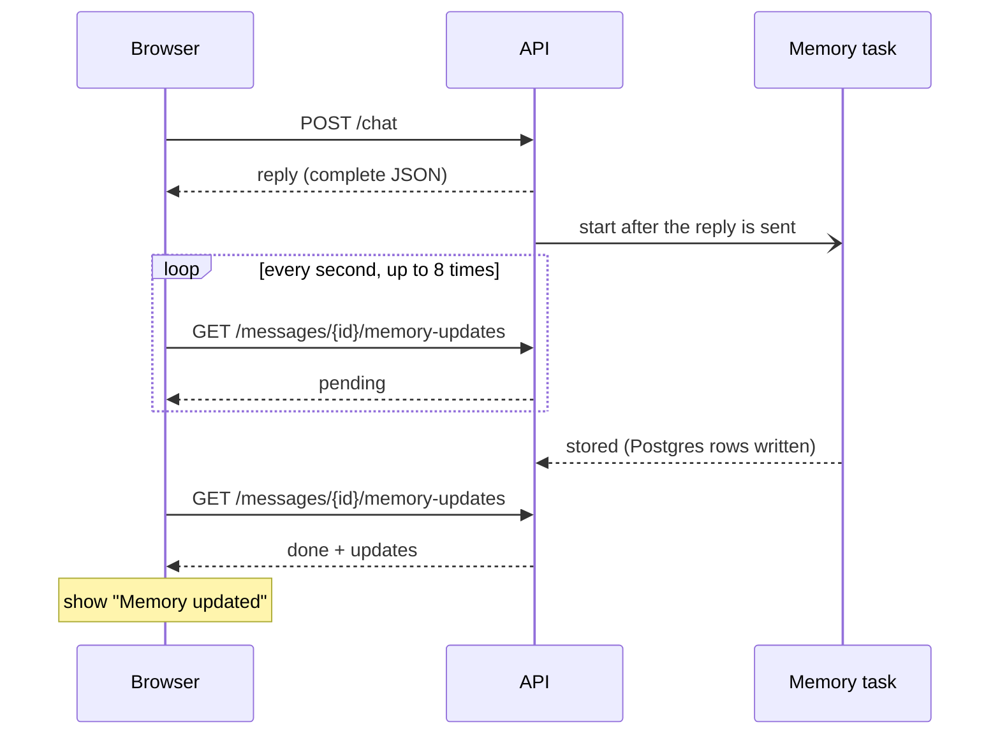
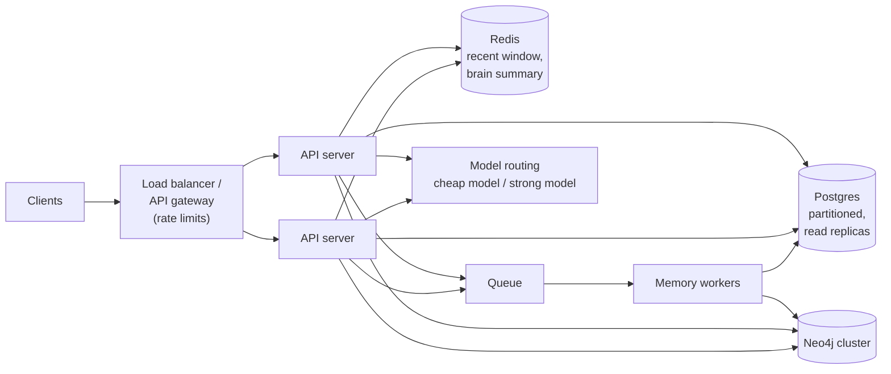

# Architecture Decisions and Trade-offs

This document records each design decision: what was chosen, what was rejected, and why. The last section lists which choices would become bottlenecks at scale and how to fix them.

Back to the [README](../README.md).

## Contents

1. [Overview](#1-overview)
2. [Hosting and deployment](#2-hosting-and-deployment)
3. [Data storage](#3-data-storage)
4. [Shared Brain graph schema](#4-shared-brain-graph-schema)
5. [Short-term memory](#5-short-term-memory)
6. [Context selection](#6-context-selection)
7. [Classifier provider](#7-classifier-provider)
8. [Orchestration](#8-orchestration)
9. [LLM layer](#9-llm-layer)
10. [Memory update and user experience](#10-memory-update-and-user-experience)
11. [Auth, onboarding and profile](#11-auth-onboarding-and-profile)
12. [Clarifying questions and feature flags](#12-clarifying-questions-and-feature-flags)
13. [Long-term scaling plan](#13-long-term-scaling-plan)

---

## 1. Overview

The build favours a small system that can be explained line by line: one VM, Postgres for logs, Neo4j for the Shared Brain only, a cheap classifier in front of the LLM, and plain Python in place of an agent framework.

| Area | Chosen | Rejected | Main reason |
|---|---|---|---|
| Backend hosting | Oracle Cloud Ampere A1 (ARM) VM | Render free tier, Oracle AMD micro, Fly.io | Always on (no cold starts) and enough RAM. Render sleeps, the micro VM has 1 GB, Fly.io has no free tier |
| Frontend hosting | Vercel | | Free, and deploys automatically from Git |
| Data storage | Postgres (Neon) + Neo4j, split by kind of data | Neo4j only; a relational database only | Chat logs are tabular; the Shared Brain is graph-shaped |
| Graph schema | Typed memory nodes + shared `LifeArea` hub nodes | One generic `Fact` node | Readable Cypher; retrieval by area is one hop |
| Short-term memory | The last 6 messages, word for word | A rolling summary only | Follow-ups need the exact wording |
| Context selection | A router + retrieval per intent | Rules only; embeddings first | Predictable, testable, explainable |
| Classifier | Jev, then an LLM, then rules | An LLM-only router | Cheaper, faster, calibrated confidence |
| Orchestration | A plain async pipeline | LangGraph | The workflow is fixed; it is not an agent |
| LLM layer | LiteLLM, primary + fallback model | One hard-wired provider | The provider is swapped by configuration |
| Memory update | A background task | Extraction inside the request | The user does not wait for extraction |
| "Memory updated" indicator | Polling | Streaming (SSE) | Far less fragile |
| Auth | Own email + password + JWT | Supabase Auth, Clerk | One less dependency; fully explainable |
| Onboarding | A form | Collecting the profile by conversation | Fixed structured data; no LLM cost |
| Risky features | Feature flags | Always on | The core flow is tested first |

## 2. Hosting and deployment

**Chosen:** the backend runs in Docker Compose on an Oracle Always Free Ampere A1 (ARM) VM. The frontend is on Vercel. Caddy sits in front of the API and provides HTTPS with an automatic certificate.

| Option | Verdict | Why |
|---|---|---|
| Oracle Ampere A1 (ARM) | Chosen | Always on, so no cold starts. Several GB of RAM. Shows real deployment work: Docker, a proxy, HTTPS |
| Render free web service | Rejected | Sleeps after 15 minutes idle and takes about a minute to wake. The demo looks broken when a reviewer opens it later |
| Oracle AMD micro (x86) | Fallback only | 1 GB of RAM and a fraction of a CPU. Workable only with swap, images built in CI and one worker |
| Fly.io | Rejected | No free tier for new users |
| Building the image on the VM | Chosen | A native ARM build avoids cross-compiling from a Mac or from CI |
| Caddy for HTTPS | Chosen | Gets and renews a certificate by itself. A Cloudflare Tunnel was considered, but a stable tunnel address needs an owned domain |

**Known risks**

- Oracle can reclaim idle free VMs (CPU under about 20% for 7 days).
- A1 capacity can be unavailable in a region, and the free A1 allowance was reportedly reduced in 2026.
- The frontend is served over HTTPS, so the API must be too, or browsers block the calls (mixed content).
- Oracle has two firewalls to open: the cloud security list and the VM's own iptables.

## 3. Data storage

**Chosen:** Postgres (Neon) holds login credentials, sessions, messages and a log of memory events. Neo4j (AuraDB) holds the Shared Brain only. Both stores share one user id and refer to each other by id. There are no joins or transactions across the two.

| Option | Verdict | Why |
|---|---|---|
| Postgres + Neo4j split | Chosen | Chat history is an append-only log read in order, which is what a relational database is good at. Only the brain is graph-shaped. Messages stay off AuraDB Free's node limit (about 200k). The schema is cleaner to present |
| Neo4j only | Rejected (it was the first plan) | Simpler to operate, but messages stored as nodes use nothing graph-like and eat the node quota. Dropped once Neon was available at no extra hosting cost |
| A relational database only | Rejected | It would work for a few dozen facts per user. But the assignment prefers a graph, and multi-hop questions (goal → area → astrological house) are clumsier as joins |
| Neo4j for the brain, in general | Chosen | Relationships are first-class. New relationship types need no migration. Queries read like the domain. A vector index is built in if embeddings are added later |

**Costs accepted**

- More code: SQLAlchemy and Alembic next to the Neo4j driver.
- Sometimes two queries where one store would need one.
- Compensating actions in place of a shared transaction. Example: signup deletes the Postgres user if the Neo4j write fails.
- Memory writes are best-effort.
- Neon's free tier suspends idle compute, so the first query after a quiet period is slower. It wakes by itself.

## 4. Shared Brain graph schema

**Chosen:** a `User` node with the profile as properties; shared `Zodiac` and `LifeArea` nodes; four memory labels (`Goal`, `Interest`, `Preference`, `Memory`) that all carry the same set of properties; each memory linked `ABOUT` one `LifeArea`.

The schema was designed from the questions the brain must answer, not from the data. The main question is "what do we know about this user in this life area?", so the life area is a node that can be reached in one hop.

| Decision | Chosen | Rejected | Why |
|---|---|---|---|
| Profile fields | Properties on `User` | Separate nodes | They are one-to-one facts that nothing else links to |
| Zodiac | One shared node per sign | Traits copied onto each user | Traits are stored once. Queries across users become possible |
| Life areas | Shared hub nodes, a fixed list of 9 | Free-text labels from the LLM | The same closed list is used for storing and for retrieving, so the two always match. Retrieval by area is one hop |
| Memory types | 4 labels + 4 relationship types, one property set | One generic `Fact` node | The Cypher is readable and mirrors the assignment's examples. The code stays uniform because the properties are shared |
| Birth place | A property | A `Place` node | No coordinates or place queries are needed yet |
| Corrections | Supersede (`status` + `superseded_by`) | Overwrite | Keeps history. A fact is never silently lost |
| Provenance | `source_message_id` on each memory | None | Audit and debugging, back to the message in Postgres |
| Chat history | In Postgres | `Session` and `Message` nodes | It is a time-ordered log, not graph-shaped |

**Known wrinkle:** each memory stores its life area twice, as a property and as an `ABOUT` relationship. The relationship is the source of truth for retrieval. The property is a convenience for display and validation.

## 5. Short-term memory

**Chosen:** the last 6 messages of the current session, sent word for word.

| Option | Verdict | Why |
|---|---|---|
| The last N messages, word for word | Chosen | "Why do you say that?" needs the assistant's exact previous claim. Short sessions are small enough to send as they are |
| A rolling summary only | Rejected | Loses the specific wording. Summaries of summaries drift. It costs an extra LLM call every turn |
| Hybrid: a summary of older turns + recent turns word for word | Later | The right answer once sessions are long enough to strain the token budget |

Short-term context belongs to one session and ends with it. Long-term memory is the few facts worth carrying into future sessions.

## 6. Context selection

**Chosen:** a router classifies each message into one of five intents plus life areas. Each intent has its own retrieval rule. General questions rank memories by confidence × importance × recency and keep the top 5.

| Option | Verdict | Why |
|---|---|---|
| Rules only (keywords) | Last-resort fallback | Instant and testable, but misses indirect phrasing |
| A classifier / LLM router | Chosen | Understands language. One cheap call decides the intent, the areas and the memory gate |
| Embeddings (ranking by similarity) | Not built. A `USE_EMBEDDINGS` setting is reserved | It would find memories across areas (a home loan for "should I quit my job?"). But it needs tuning, is harder to explain, and similar is not the same as relevant |
| The router is shown a list of memory titles and picks ids | Noted | Accurate, because the model sees what exists. The prompt grows with the number of memories |
| A Jev relevance check per memory | Noted | Judges relevance, not similarity. A third strategy to compare |

Retrieval per intent:

| Intent | Retrieval |
|---|---|
| `general` | Profile + zodiac + the top 5 active memories in the routed areas |
| `followup` | The same memories the previous answer used (no new search) |
| `memory_query` | All active memories in the area (or all of them), plus profile facts |
| `profile_query` | Profile + zodiac |
| `smalltalk` | Name + the last 2 messages |

Three smaller decisions:

- **Why follow-ups reuse memories.** The explanation must rest on the same facts the answer used.
- **Why a fixed list of areas.** It is the retrieval key shared by storing and fetching. If the LLM could invent areas, a memory stored under "work" would never be found by a question routed to "career".
- **Why `context_used` is in every response.** For debugging, and so tests can assert that irrelevant memories stayed out.

**Why area filtering before embeddings.** Area filtering is exact, cheap and easy to test: a memory is either in the area or not. It is enough while a user has tens of memories. Embeddings become useful when a user has hundreds of memories and an area returns too many.

## 7. Classifier provider

**Chosen:** TypeSafe's Jev as the primary router, behind a `Classifier` interface. The LLM router takes over when Jev's confidence is below 0.7, or on an error or a timeout. Keyword rules are used if both fail. One Jev call returns the intent, the area scores and the memory-gate score.

| Option | Verdict | Why |
|---|---|---|
| Jev (TypeSafe) | Chosen, primary | Very cheap. Answers in roughly 70 to 500 ms. Its calibrated confidence drives the fallback. It cannot return an option that was not offered |
| LLM router | Fallback | Strong understanding, but slower and costlier per message |
| OpenAI Decisions API | Alternative | The same idea, behind the same interface. In limited preview, with no published price or calibration data yet |
| Keyword rules | Last resort | Keep the chat working when both providers fail |

**Risks noted**

- Jev is new, and its headline numbers come from its own evaluations.
- Its service runs on the US West Coast, which adds latency from India.
- The model version is pinned (`jev-1.13.0`) so behaviour cannot change silently.
- Jev only classifies. Writing the reply and extracting memory content stay with the LLM.

## 8. Orchestration

**Chosen:** plain async Python. Small step functions work on one `TurnState` object. Branching is a dictionary lookup on the router's intent. LangSmith's `@traceable` decorator gives a trace of every step without a framework.

| Option | Verdict | Why |
|---|---|---|
| Plain async pipeline | Chosen | The flow is short and fixed. Our code, not the LLM, picks each step. Every line can be explained. No framework version churn |
| LangGraph | Rejected for now | Its strengths (agent loops, checkpointed pause and resume, human-in-the-loop) are not needed. Its memory stores would overlap with our own Neo4j brain |
| CrewAI / AutoGen | Rejected | Built for several agents playing roles. There is one fixed flow here |
| OpenAI Agents SDK | Rejected | Tied to OpenAI, against "any provider" |

**When LangGraph would earn its place**

- Tool-using features (transits, panchang, booking an astrologer) turn the assistant into an agent loop.
- Many branches and retrieval steps that run in parallel.
- Durable runs that can be resumed on stateless servers.

Because each step is already a function over one state object, moving later means wrapping the functions as graph nodes. The logic would not be rewritten.

## 9. LLM layer

**Chosen:** an `LLMProvider` interface (`generate`, `generate_json`) implemented with LiteLLM; a primary model with retries and an automatic fallback to a second model; a `FakeLLM` for tests. Model names are configuration.

| Option | Verdict | Why |
|---|---|---|
| LiteLLM behind our own interface | Chosen | One call shape for more than 100 providers. Built-in retries. Switching provider means changing environment values |
| One provider wired in directly | Rejected | The assignment asks for a provider that can be swapped |
| LangChain chat models | Rejected | Only worth it together with LangGraph |

**Notes**

- Development started on Gemini's free tier. The deployed instance now uses a small OpenAI model, changed by editing two environment values and nothing else. That was a real test of the abstraction.
- Gemini's free tier covers only Flash models and may use inputs for training, so a paid tier is the choice for real user data.
- The choice of model matters less than expected: the two tasks (answer, extract JSON) are within reach of any major model. The smallest models are noticeably looser at following every prompt rule; see the live results in the [testing document](testing-and-evaluation.md#6-results-with-a-real-model).

## 10. Memory update and user experience

**Chosen:** memory extraction runs as a FastAPI background task after the reply, gated by the router's "has a lasting fact" score. The frontend polls a memory-updates endpoint (every second, for up to 8 seconds) and shows a "Memory updated" chip.

| Option | Verdict | Why |
|---|---|---|
| Background task | Chosen | The user never waits for extraction. It maps directly onto queue workers later |
| Extraction inside the request | Rejected | Every reply would wait for an extra LLM call |
| A memory gate before extraction | Chosen | Most messages ("why?", "thanks", questions) skip the extraction call completely |
| Extraction merged into the router call | Rejected for now | Fewer calls, but it puts extraction on the critical path and complicates the router |
| Polling for the chip | Chosen | Simple and robust. Reads Postgres only |
| Streaming (SSE) for tokens and the memory event | Documented, not built | About a day of extra work, and fragile (see below) |
| Extraction inside the request, to show the chip at once | Rejected | Slows every reply |

**Polling versus streaming**

Each request above is short and independent. If one fails, the next one simply tries again, and the worst case is a missing chip.

Streaming would need one long-lived connection, and that brings failure modes polling does not have:

| Failure mode | What goes wrong |
|---|---|
| Proxy buffering | A proxy holds the tokens back and delivers them all at once, so nothing "streams" |
| Dropped connections | The reply is cut half-way; the client must detect it and recover |
| Idle timeouts | A proxy closes a connection that is quiet while the model thinks |
| Errors in mid-stream | The status code was already sent as 200, so the error needs its own in-stream format |
| Double sends | A client that reconnects and retries can create the same message twice, so requests need an idempotency key |
| Login header | The browser's `EventSource` cannot send an `Authorization` header, so the token needs another route |

The `POST /chat` JSON contract from the assignment stays in either case. Streaming would be an extra `/chat/stream` endpoint.

## 11. Auth, onboarding and profile

**Chosen:** our own email + bcrypt password + JWT, kept minimal (signup, login, who-am-I). A one-time onboarding form after signup. The sun sign is computed by the backend from the date of birth. Profile corrections are allowed through chat.

| Decision | Chosen | Rejected | Why |
|---|---|---|---|
| Auth | Own JWT auth | Supabase Auth, Clerk | One less dependency. Explainable line by line. Auth is not what the assignment judges |
| Profile collection | A form | Collecting by conversation | It is fixed structured data: faster, validated, no LLM calls |
| Birth time | Optional, with "I don't know" | Required | Many people do not know it |
| Sun sign | Computed on the server | Asked from the user | Never trust a user to type a derived value |
| Corrections through chat | Allowed (recorded as `profile_updated_via: chat`) | Edits through the form only | Covers the assignment's "user correcting information" case |
| Missing profile | The backend answers generally and nudges | A hard error | Anyone can call `/chat` directly. Covers the "missing information" case |
| User id in requests | From the login token only | From the request body | A client cannot act as another user |

## 12. Clarifying questions and feature flags

**Status: planned, not built.** The setting `CLARIFY_ENABLED` (default off), the response fields `type` and `options`, and the `pending_clarification` column on sessions already exist, so the feature can be added without changing the API. With the setting off, the prompt tells the model to make a reasonable assumption and state it, so the model does not start asking questions on its own.

The design:

| Decision | Chosen | Rejected | Why |
|---|---|---|---|
| When to ask | Fixed triggers (a timing question with an unknown birth time; a reference that could mean two different goals; no area detected) plus permission in the prompt | The LLM decides freely | Predictable and testable. A templated question needs no generation call |
| Understanding the reply | The pending question is saved on the session; the next turn checks it first | Rely on the history alone | A reply like "the job one" means nothing by itself |
| Rollout | A feature flag, off by default | Always on | It is the feature with the least certainty. A bug in it must not break basic chat |

All settings that switch behaviour:

| Setting | Default | Purpose |
|---|---|---|
| `CLARIFY_ENABLED` | false | Clarifying questions (planned) |
| `USE_EMBEDDINGS` | false | Ranking by similarity (reserved, not built) |
| `CLASSIFIER` | `jev` | Switch the router to `llm` |
| `MEMORY_GATE_ENABLED` | true | Skip extraction when the gate score is low |

The settings also work as a demonstration: the same question can be run with a feature off and on to show the difference.

## 13. Long-term scaling plan

At 1 million daily users sending 10 messages each, traffic averages about 115 messages per second and peaks near 1,000 per second. Each message makes 1 to 3 model calls. So **model cost and latency dominate, not the databases.**

Most current choices hold. The ones below break first.

| Current decision | Becomes a bottleneck when | How to tackle it |
|---|---|---|
| One VM, one uvicorn worker | Traffic exceeds what one process handles; any VM outage takes the service down | Stateless app servers behind a load balancer; containers on a managed platform with autoscaling |
| Rate limiting in memory | There is more than one worker or server (each keeps its own counts) | Shared counters in Redis or at the API gateway |
| FastAPI background tasks for memory | Tasks are lost on restart; extraction load competes with chat | A queue (SQS or Kafka) and separate memory workers; `message_id` as the idempotency key |
| Best-effort writes across the two stores | The rate of inconsistencies becomes noticeable at volume | The outbox pattern: write an event in Postgres; workers apply it to Neo4j with retries |
| Neo4j AuraDB Free, one instance | Node limits and one instance's throughput | A paid cluster. Partition by `user_id` (each user's graph is isolated). Cache each user's brain summary in Redis so most reads skip the graph. Neo4j sharding is weaker than most databases, so this needs early planning |
| Messages in one Postgres table | Billions of rows; history reads slow down | Partition by time or by user; read replicas; archive old sessions; cache the recent window per session |
| Retrieval by area only | Users collect hundreds of memories; an area returns too much | Turn on embeddings with a vector search filtered per user (avoid the global top-K trap, where the nearest results belong to other users); query rewriting; or Jev relevance scoring |
| A window of the last 6 messages only | Long sessions exceed the token budget | A rolling summary of older turns + recent turns word for word |
| Polling for memory events | Many clients polling at once hit the API | SSE on the same connection as a streamed reply, or push notifications |
| One classifier vendor (Jev, US West) | A vendor outage, latency from India, price changes | The `Classifier` interface already allows swapping (OpenAI Decisions API, LLM router); routing across providers with health checks |
| LLM cost per message | Cost grows in line with traffic | Route easy messages to cheap models; prompt caching; the memory gate; smaller prompts through better retrieval |
| Plain async pipeline | Tool-using features, many branches, resumable runs | Wrap the step functions as LangGraph nodes; a Postgres or Redis checkpointer |
| Tracing every request | Trace volume and cost at millions of requests | Sample the traces; keep metrics for all requests |
| Personal data stored in plain form | Regulatory exposure at scale (India's DPDP Act) | Encrypt birth data; access logging; export and delete of memories visible to the user |

**The shape at scale**

