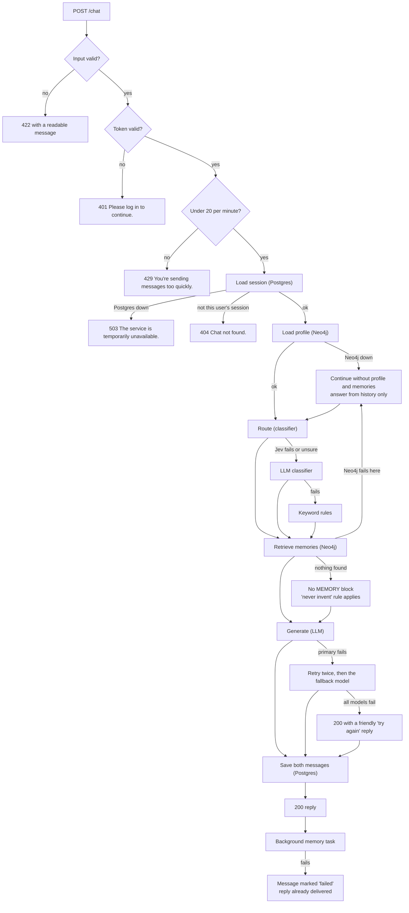
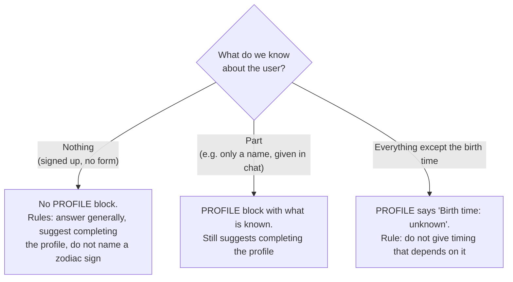
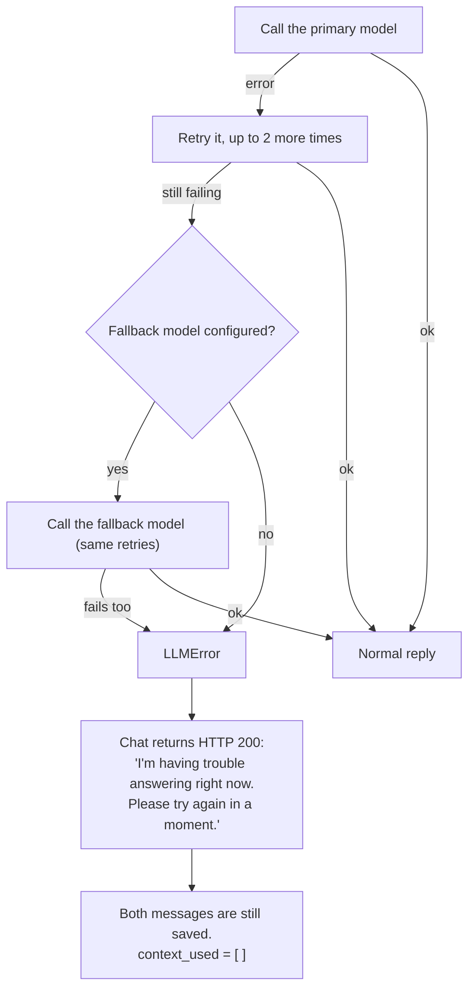
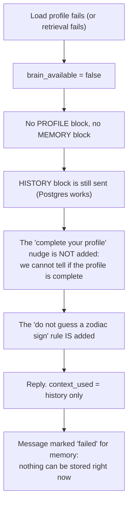
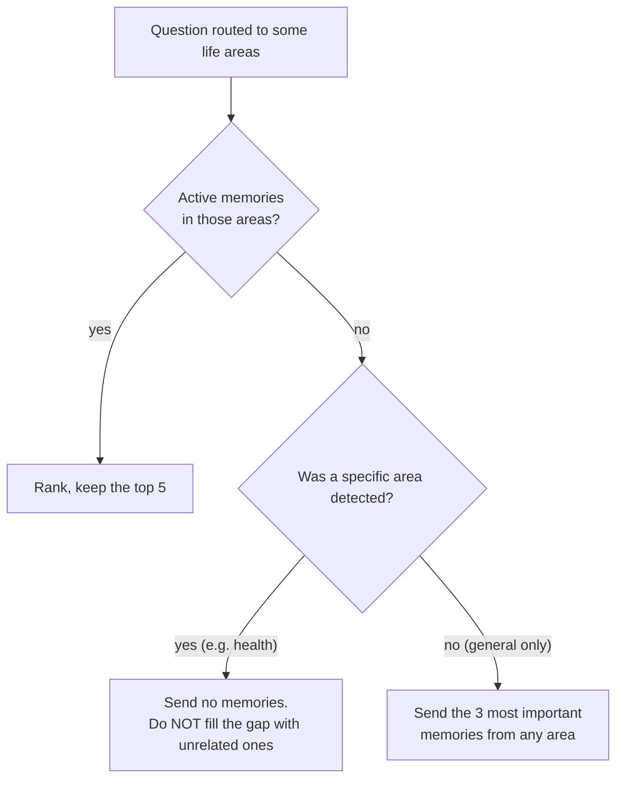
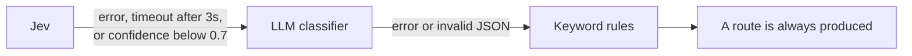
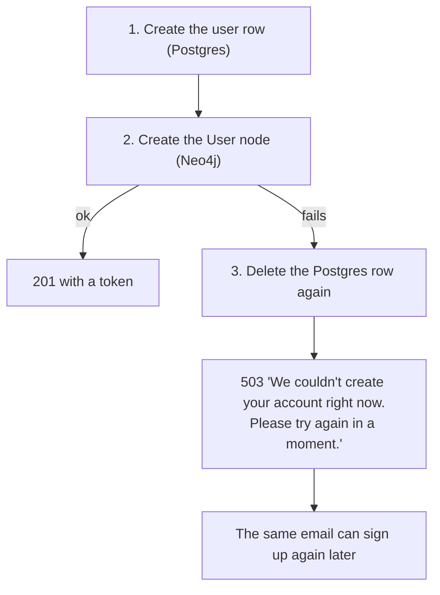

# Error Handling

This document lists every failure the application handles, what the user sees in each case, and the test that proves it.

Back to the [README](../README.md).

## Contents

1. [Principles](#1-principles)
2. [Where things can fail in one chat turn](#2-where-things-can-fail-in-one-chat-turn)
3. [The six cases from the assignment](#3-the-six-cases-from-the-assignment)
4. [Other failures that are handled](#4-other-failures-that-are-handled)
5. [What the frontend does](#5-what-the-frontend-does)
6. [Summary table](#6-summary-table)
7. [What is not handled](#7-what-is-not-handled)

---

## 1. Principles

1. **Answer whenever possible.** If one part is down, the chat uses what is left. It does not give up because the Shared Brain or the router is unavailable.
2. **Say clearly when it is not possible.** The user gets a short, plain sentence and the right status code.
3. **Never show a stack trace.** Every failure ends in a JSON body with a `detail` message.
4. **Never invent.** When information is missing, the system tells the LLM it is missing. It does not leave a gap for the LLM to fill.
5. **Memory is best-effort.** A failure while storing a memory never changes or delays the reply.
6. **Leave no half-written data.** Where two databases are involved, the write order is fixed and a failed second step is undone or logged.
7. **Do not reveal what exists.** "Not yours" and "does not exist" give the same 404.

## 2. Where things can fail in one chat turn



## 3. The six cases from the assignment

### 3.1 Invalid input

Every request body is checked by a Pydantic model before any code runs.

| Input | Status | Message |
|---|---|---|
| Empty or blank chat message | 422 | Message cannot be empty. |
| Chat message over 2,000 characters | 422 | Message cannot be longer than 2000 characters. |
| `session_id` missing or not a valid id | 422 | Input should be a valid UUID... |
| Invalid email at signup | 422 | value is not a valid email address... |
| Password under 8 characters, or over 72 bytes | 422 | String should have at least 8 characters |
| Date of birth in the future or before 1900 | 422 | Date of birth cannot be in the future. |
| Blank name or birth place | 422 | This field cannot be empty. |
| Birth time marked known but not given | 422 | birth_time is required when birth_time_known is true. |
| A sun sign sent by the user | Ignored | The sign is always computed from the date of birth |
| A `user_id` in the chat body | Ignored | The user always comes from the login token |

**Example**

```http
POST /chat
{ "session_id": "f16280a1-9023-4f0a-93e3-02cd6c04f7af", "message": "   " }
```

```json
// 422
{ "detail": [ { "type": "value_error", "loc": ["body", "message"],
                "msg": "Value error, Message cannot be empty.", "input": "   " } ] }
```

The frontend turns this into the plain text "Message cannot be empty." It also stops most invalid input before it is sent: the Send button is disabled for a blank message and the box does not accept more than 2,000 characters.

**The same care is applied to the LLM's output.** The extraction step returns JSON, which is validated against a schema. Then each item is checked (life area in the fixed list, scores between 0 and 1, the target memory belongs to this user, dates valid). A bad item is dropped and logged; the good items are still applied.

| Tests | |
|---|---|
| `test_invalid_requests_are_rejected` | Empty, 2,001 characters, missing session, bad session id give 422. Exactly 2,000 characters is accepted |
| `test_signup_rejects_invalid_input` | Bad email, short password, over-long password give 422 and create no user |
| `test_invalid_profile_is_rejected` (several cases), `test_missing_required_field_is_rejected` | Each invalid profile field gives 422 |
| `test_sun_sign_sent_by_the_user_is_ignored` | The stored sign comes from the date of birth |
| `test_invalid_items_are_dropped_and_valid_ones_still_applied` | Bad extracted items are dropped, good ones kept |
| `test_generate_json_falls_back_when_the_primary_returns_invalid_json` | Invalid JSON from a model counts as that model failing |

### 3.2 Missing profile information

There are three levels of "missing".



| Situation | What happens |
|---|---|
| No profile at all | The reply is general and suggests completing the birth details. `context_used` is empty |
| Partial profile | What is known is used. The suggestion to complete the profile remains |
| Birth time unknown | The prompt says "Birth time: unknown" and forbids timing that depends on it |
| A fact that was never given (for example a partner's name) | The rule "Never invent facts about the user ... say that you don't know it yet" applies |

**Example (real response, new user, shortened)**

```json
{ "response": "... Since your birth details aren't complete yet, I can't tailor this to your deeper timing or strengths. If you finish your profile, I'll personalize your career themes.",
  "context_used": [] }
```

The user is never blocked. They can chat before filling the form, and can even give their details in chat: the memory step stores them on the profile.

| Tests | |
|---|---|
| `test_scenario_1_new_user_gets_a_generic_answer_with_a_nudge` | No profile: empty `context_used`, the nudge rule and the "do not guess a sign" rule are in the prompt |
| `test_scenario_8_missing_information_is_marked_unknown_not_invented` | Unknown birth time and an unknown fact |
| `test_partial_profile_from_chat_is_used_and_still_nudges` | A profile with only a name |
| `test_me_for_a_new_user_has_no_profile` | `GET /users/me` returns `profile: null`, not an error |

### 3.3 LLM failure

There are three lines of defence.



Why a 200 and not an error status: from the user's point of view the assistant answered, just not usefully. The conversation stays intact and the user can simply send the message again. An empty reply from a model is also treated as a failure.

**Example**

```json
// 200
{ "response": "I'm having trouble answering right now. Please try again in a moment.",
  "user_id": "...", "session_id": "...", "message_id": "...",
  "type": "answer", "options": null,
  "context_used": [] }
```

`context_used` is empty on purpose: nothing was actually used to produce an answer, so nothing is claimed.

If the LLM is also down when the background memory step runs, that message is marked `failed`. The user's message itself is saved in the chat history and is not lost.

| Tests | |
|---|---|
| `test_llm_failure_returns_a_friendly_reply_and_still_saves_the_turn` | Status 200, the friendly text, empty `context_used`, no "Traceback" in the body, both messages saved |
| `test_generate_falls_back_when_the_primary_fails` | The fallback model answers |
| `test_generate_raises_llm_error_when_both_models_fail` | Both failing raises `LLMError` |
| `test_without_a_fallback_model_only_the_primary_is_tried` | An empty fallback setting is fine |
| `test_an_empty_reply_counts_as_a_failure` | An empty reply moves on to the fallback |
| `test_extraction_failure_marks_the_message_failed_but_chat_is_fine` | A failing extraction call does not affect the reply |

### 3.4 Database / graph failure

The two databases fail differently because they do different jobs.

| | Neo4j (Shared Brain) down | Postgres down |
|---|---|---|
| **Chat** | **Still works.** Answers from the conversation history only | 503: the session cannot be checked and nothing can be saved |
| **Login** | Still works (Postgres only) | 503 |
| **Signup** | 503, and the half-created account is removed | 503 |
| **Profile, Memory page** | 503 "Your profile is temporarily unavailable." | 503 |
| **Chat list, messages** | Still works (Postgres only) | 503 |
| **`/health`** | 503 with `"neo4j": "down"` | 503 with `"postgres": "down"` |

**Neo4j down during a chat turn**



Two details matter here. The user is not wrongly told to "complete your profile" when the real problem is on our side. And because the sign cannot be read, the LLM is told not to guess one.

The Neo4j driver is set to give up after 5 seconds (its default is 30), so the user is not left waiting.

**Postgres down**

```json
// 503
{ "detail": "The service is temporarily unavailable. Please try again in a moment." }
```

**Neo4j down outside chat**

```json
// 503
{ "detail": "Your profile is temporarily unavailable. Please try again in a moment." }
```

**The health endpoint**

```json
// 200
{ "status": "ok", "postgres": "up", "neo4j": "up" }

// 503
{ "status": "degraded", "postgres": "up", "neo4j": "down" }
```

The application starts even if Neo4j is down at startup, so `/health` can report the problem.

| Tests | |
|---|---|
| `test_neo4j_down_answers_from_history_only` | Chat replies; `context_used` is `["history"]`; no profile or memory block; no nudge; the "do not guess a sign" rule is present; the message is marked `failed` |
| `test_neo4j_failing_only_during_retrieval_is_handled_the_same_way` | A failure half-way through gives the same safe result |
| `test_postgres_down_returns_503` | 503 with "temporarily unavailable"; the LLM is never called |
| `test_auth_returns_503_when_postgres_is_down`, `test_sessions_return_503_when_postgres_is_down` | Other endpoints give 503 |
| `test_login_does_not_need_neo4j` | Login works with Neo4j down |
| `test_profile_save_returns_503_when_neo4j_is_down` | 503, and the "profile complete" flag is not set |
| `test_health_reports_neo4j_down`, `test_health_reports_postgres_down` | Each store is reported separately |

### 3.5 Empty memory

A user with no memories is a normal case, not an error.

| Where | What happens |
|---|---|
| Chat | The `[MEMORY]` block is left out. The reply uses the profile and the sun sign |
| "What do you remember about me?" | The profile facts are listed. The rule "say that you don't know it yet" covers the rest |
| Memory page | Returns the profile and an empty list: `{"profile": {...}, "memories": {}}` |
| Background extraction | Sees "EXISTING MEMORIES: (none)" and can only create |

**Example: the first message of a user with a profile and no memories (real response)**

```json
{ "response": "Based on what you've told me: you're a Leo (Fire) type ...",
  "context_used": ["user_profile", "zodiac"] }
```

| Tests | |
|---|---|
| `test_memory_page_for_a_new_user_is_empty` | Empty page, status 200 |
| `test_first_message_has_no_history_block_or_label` | An empty block is left out, and so is its label |
| `test_a_message_with_nothing_worth_storing_ends_as_done_with_no_updates` | Extraction returning nothing ends as `done` with no updates |

### 3.6 No relevant context

The user has memories, but none fit the question.



| Situation | What happens |
|---|---|
| A health question, only career memories stored | No memories are sent. The answer uses the profile only |
| A vague question ("Any guidance for me?") | The 3 most important memories from any area are sent |
| A follow-up with nothing to follow | It is handled as a general question |
| A follow-up whose memory was deleted meanwhile | That memory is left out |
| The router is unsure of the intent | The LLM classifier is asked; if that fails, keyword rules |

The reasoning behind the second and first rows being different: for a specific question, an unrelated memory is noise and can mislead the answer. For a vague question there is no "wrong" area, so the most important facts are the best guess.

**Example (real response)**

```json
// "Any advice for my health this month?"  (only a career goal is stored)
{ "context_used": ["user_profile", "zodiac", "history"] }
```

| Tests | |
|---|---|
| `test_scenario_6_an_irrelevant_memory_is_not_included` | The career goal is not sent for a sleep question |
| `test_general_with_no_area_falls_back_to_the_three_most_important` | The vague-question fallback |
| `test_followup_without_a_previous_reply_is_treated_as_general` | The follow-up fallback |
| `test_followup_skips_a_memory_deleted_since` | A deleted memory is left out |

## 4. Other failures that are handled

### 4.1 The classifier (router) fails



The keyword rules use no network, so the chain always ends with an answer. Jev retries are switched off on purpose: moving to the next classifier is faster than waiting. When the rules answer, they leave the memory gate open, so a lasting fact is not lost just because the router was down.

Tests: `test_chain_asks_the_llm_when_jev_fails_or_times_out`, `test_chain_asks_the_llm_when_jev_is_not_confident`, `test_chain_uses_rules_when_the_llm_fails_too`, `test_jev_without_an_api_key_starts_without_jev`.

### 4.2 The background memory task fails

The reply has already been sent, so nothing here can affect it.

| What fails | Result | Test |
|---|---|---|
| The extraction LLM call | Message marked `failed`. Nothing stored | `test_extraction_failure_marks_the_message_failed_but_chat_is_fine` |
| Neo4j, while writing | Message marked `failed`. Nothing stored | `test_neo4j_failure_during_the_task_marks_the_message_failed` |
| Postgres, after Neo4j succeeded | The memory exists and will be used. Its audit row is missing. The message is marked `failed`, and a log line starting with `INCONSISTENCY` lists the memory ids | `test_postgres_failure_after_neo4j_success_is_logged_as_an_inconsistency` |
| One extracted item is invalid | That item is dropped; the others are applied | `test_invalid_items_are_dropped_and_valid_ones_still_applied` |
| The LLM names a memory that is not this user's | The item is dropped | `test_update_cannot_touch_another_users_memory` |

The frontend treats `failed` the same as "nothing to show": no chip appears. It does not show an error for something the user did not ask for.

### 4.3 Signup fails half-way

Signup writes to both databases. There is no transaction across them, so a failure of the second write is undone by hand.



Tests: `test_signup_removes_the_postgres_user_when_neo4j_fails`, `test_signup_can_be_retried_after_a_neo4j_failure`.

Two users signing up with the same email at the same moment: the unique index in Postgres stops the second one, which gets the normal 409. Test: `test_signup_with_an_existing_email_returns_409`.

### 4.4 Login and access

| Situation | Status | Message | Test |
|---|---|---|---|
| No token | 401 | Please log in to continue. | `test_protected_endpoint_without_a_token_returns_401` |
| Malformed token | 401 | same | `test_protected_endpoint_with_a_bad_token_returns_401` |
| Expired token | 401 | same | `test_expired_token_returns_401` |
| Token signed with a different secret | 401 | same | `test_token_signed_with_another_secret_returns_401` |
| Token of a deleted user | 401 | same | `test_token_for_a_deleted_user_returns_401` |
| Wrong password | 401 | Incorrect email or password. | `test_login_with_wrong_password_or_unknown_email_returns_401` |
| Unknown email | 401 | The same message, so it does not reveal which emails exist | same |
| Email already registered | 409 | An account with this email already exists. Try logging in instead. | `test_signup_with_an_existing_email_returns_409` |
| Someone else's chat | 404 | Chat not found. | `test_another_users_session_returns_404_and_saves_nothing` |
| Someone else's memory | 404 | Memory not found. | `test_a_user_cannot_delete_another_users_memory` |
| Someone else's message (polling) | 404 | Message not found. | `test_polling_is_limited_to_the_users_own_user_messages` |

### 4.5 Rate limit

More than 20 chat messages in a minute from one user:

```json
// 429
{ "detail": "You're sending messages too quickly. Please wait a moment and try again." }
```

The count is per user, and only `/chat` is limited. A request without a token is still a 401, not a 429.

Tests: `test_the_21st_chat_request_in_a_minute_is_rejected`, `test_the_limit_is_counted_per_user`, `test_only_chat_is_rate_limited`, `test_a_request_without_a_token_is_still_a_401`.

### 4.6 Deleting a memory

| Situation | Result | Test |
|---|---|---|
| Deleting twice, or an unknown id | 404 "Memory not found." | `test_deleting_a_memory_removes_it_everywhere_but_keeps_the_audit_log` |
| Deleting another user's memory | 404, and the memory still exists | `test_a_user_cannot_delete_another_users_memory` |
| Deleting a memory that replaced an older one | The older one stays superseded; it does not come back | `test_deleting_a_memory_does_not_revive_the_one_it_superseded` |
| A follow-up after its memory was deleted | The memory is left out | `test_followup_skips_a_memory_deleted_since` |

## 5. What the frontend does

| Situation | What the user sees | Browser test |
|---|---|---|
| The server cannot be reached | "Could not reach the server. Check your connection and try again." | C8, E16 |
| A chat message fails to send | The message is removed from the conversation and **put back in the text box**, with the error shown. Nothing the user typed is lost | E16 |
| The login token has expired | The user is sent back to the login page | A6 |
| A reply takes more than 3 seconds | "Thinking…" changes to "Connecting…" | C7, E18 |
| The rate limit is hit | The server's message is shown | E17 |
| A chat address that is not the user's, or does not exist | The user is taken to their own latest chat | E11 |
| A second message while the first is being answered | Sending is disabled until the reply arrives | E19 |
| A reply arrives after the user switched chats | It does not appear in the other chat | E20 |
| Memory polling fails | Nothing is shown; the chip is optional | |
| A validation error from the server | Shown as plain text, for example "This field cannot be empty." | D6, G5 |

## 6. Summary table

| Failure | Status | The user sees | Fallback |
|---|---|---|---|
| Invalid input | 422 | A readable message | None needed |
| No or bad token | 401 | Please log in to continue. | Sent to login |
| Not the user's resource | 404 | Chat / Memory / Message not found. | |
| Duplicate email | 409 | Account already exists | |
| Rate limit | 429 | Sending too quickly | Wait a moment |
| No profile | 200 | A general answer and a suggestion | Answer without personal context |
| Birth time unknown | 200 | An answer without timing claims | The prompt says "unknown" |
| Empty memory | 200 | An answer from the profile | Memory block left out |
| No relevant memory | 200 | An answer from the profile | Send nothing, or the top 3 for a vague question |
| Jev fails | 200 | A normal answer | LLM classifier |
| LLM classifier fails | 200 | A normal answer | Keyword rules |
| Primary model fails | 200 | A normal answer | Retries, then the fallback model |
| All models fail | 200 | "I'm having trouble answering right now..." | The turn is saved; send again |
| Neo4j down, chat | 200 | An answer from the conversation | History only |
| Neo4j down, other pages | 503 | Your profile is temporarily unavailable. | |
| Neo4j down, signup | 503 | We couldn't create your account right now. | The Postgres row is removed |
| Postgres down | 503 | The service is temporarily unavailable. | |
| Memory extraction fails | 200 | A normal answer, no chip | Message marked `failed` |
| Memory written but not recorded | 200 | A normal answer, no chip | `INCONSISTENCY` log line |

## 7. What is not handled

- A memory step that fails is not retried. The message stays marked `failed`, and the user would have to state the fact again.
- If the server restarts while a background memory task is running, that task is lost and the message stays `pending`.
- A memory that was written to Neo4j but not recorded in Postgres is logged, not repaired automatically.
- There is no circuit breaker: a failing service is tried again on every request (with short timeouts).
- The rate-limit counters are in the memory of one process, so they reset on restart and assume a single worker.

The fixes for these are listed under "Production considerations" in the README.
