# Testing and Evaluation

This document explains how the application is tested, walks through each test scenario with an example, and describes how to measure whether the Shared Brain improves the answers.

Back to the [README](../README.md).

## Contents

1. [Summary](#1-summary)
2. [How the tests are built](#2-how-the-tests-are-built)
3. [The eight scenarios from the assignment](#3-the-eight-scenarios-from-the-assignment)
4. [All other backend tests](#4-all-other-backend-tests)
5. [Browser tests](#5-browser-tests)
6. [Results with a real model](#6-results-with-a-real-model)
7. [Evaluating the Shared Brain](#7-evaluating-the-shared-brain)
8. [Known limits of the tests](#8-known-limits-of-the-tests)

---

## 1. Summary

| Suite | Tests | Result | Runs against | LLM |
|---|---|---|---|---|
| Backend (`backend/tests`, pytest) | 175 | 175 passed in about 30 seconds | Real Postgres and Neo4j in Docker | Fake |
| Browser (`frontend/e2e`, Playwright) | 70 | 70 passed in about 1.6 minutes | The real frontend and the real backend | Real |

Both suites were run on 8 October 2026 against the final code. The backend suite also runs in GitHub Actions on every push.

The eight scenarios the assignment lists are covered by ten named tests (`test_scenario_1_...` to `test_scenario_8_...`). The other 165 backend tests cover the rules around them: ranking, isolation between users, the memory gate, validation, failures, and each endpoint.

## 2. How the tests are built

### 2.1 The idea: test what is sent to the LLM, not what it writes

An LLM's wording changes from run to run. A test that checks the reply text would be slow, cost money and fail at random. So the backend tests replace the two outside services with fakes and check two things instead:

1. **What was sent to the LLM** (the prompt). If the career goal is in the prompt, retrieval worked.
2. **What was stored** in Postgres and Neo4j. If a `Goal` node exists with the right links, memory creation worked.

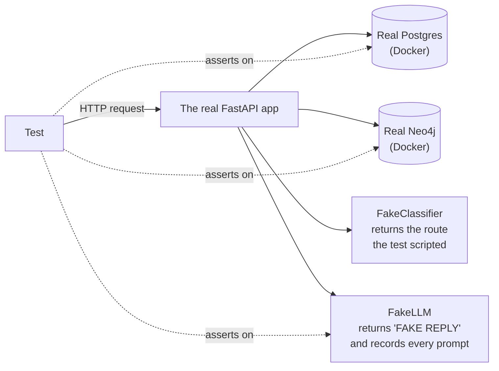

### 2.2 The pieces

| Piece | What it does |
|---|---|
| `FakeLLM` | Implements the same interface as the real provider. `generate` returns `"FAKE REPLY"` and saves the prompt in `calls`. `generate_json` returns the extraction result the test scripted. Setting `fail = True` makes every call fail |
| `FakeClassifier` | Returns the routing decision the test scripted, for example "intent `general`, area `career`, durable-fact score 0.9" |
| Real databases | Postgres and Neo4j run in Docker. The SQL, the Cypher and the Alembic migration are all really executed |
| Clean start | Before every test, all user data is removed from both databases. The seeded zodiac signs and life areas are kept |
| Safety | The test setup overwrites the database settings before the application is imported. A real `.env` file can never point the tests at production |
| `neo4j_down`, `postgres_down` | Fixtures that make one database unreachable for a test |

### 2.3 A test, line by line

```python
async def test_scenario_6_an_irrelevant_memory_is_not_included(client, fake_llm, fake_classifier):
    headers = await onboard(client)                                   # sign up + fill the profile
    goal_id = await add_memory(headers, GOAL_TEXT, life_area="career")  # put a career goal in Neo4j
    session_id = await new_session(client, headers)
    fake_classifier.results = [route("general", ["health"])]          # the router will say "health"

    body = await ask(client, headers, session_id, "How can I sleep better?")

    assert f"goal:{goal_id}" not in body["context_used"]              # not reported as used
    assert "[MEMORY]" not in prompt_text(fake_llm)                    # and not sent to the LLM
```

### 2.4 Running the tests

```bash
docker compose -f docker-compose.dev.yml up -d      # local Postgres and Neo4j
cd backend && pytest                                 # 175 tests
cd frontend && npm run test:e2e                      # 70 browser tests
```

## 3. The eight scenarios from the assignment

Each scenario below shows the flow, an example, the expected result, the actual result of the automated test, and what the real model did when the same thing was run by hand (the "live" result).

In every example the user is Rahul, born 15 August 1995 at 14:30 in Delhi (sun sign: Leo), unless stated otherwise.

---

### Scenario 1: New user

A user who has signed up but given no profile and has no memories.

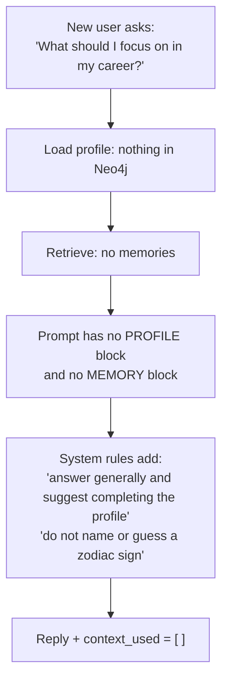

| | |
|---|---|
| **Test** | `test_scenario_1_new_user_gets_a_generic_answer_with_a_nudge` |
| **Input** | A signed-up user with no profile sends "What should I focus on in my career?" |
| **Expected** | `context_used` is empty. The prompt has no `[PROFILE]` and no `[MEMORY]` block. The prompt contains the rule to suggest completing the birth details and the rule not to guess a zodiac sign |
| **Actual** | Passed. All of the above hold |
| **Live** | `context_used: []`. The reply gave general career advice and ended: "Since your birth details aren't complete yet, I can't tailor this ... If you finish your profile, I'll personalize your career themes." |

A second part of this scenario is the assignment's own first message, sent by a user who never filled the form:

> My name is Rahul. I was born on 15 August 1995 in Delhi. I'm planning to switch jobs next year.

| | |
|---|---|
| **Tests** | `test_profile_given_in_chat_completes_the_profile`, `test_partial_profile_from_chat_does_not_complete_it` |
| **Expected** | Name, date of birth and birth place are saved on the `User` node, the sun sign is computed, the profile counts as complete, and a career goal is created |
| **Actual** | Passed |
| **Live** | Four updates were recorded: "Name updated", "Date of birth updated", "Birth place updated", and a created goal "Job switch next year". `GET /users/me` then showed `profile_complete: true`, sun sign Leo, `profile_updated_via: "chat"`. The next career question used `["user_profile", "zodiac", "history", "goal:..."]` |

---

### Scenario 2: Creating a long-term memory

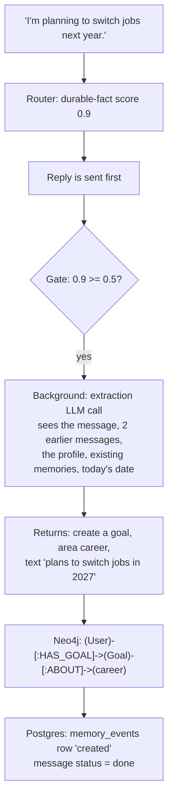

| | |
|---|---|
| **Tests** | `test_scenario_2_a_lasting_fact_becomes_a_goal_node`, `test_scenario_2_what_the_extraction_llm_is_sent` |
| **Input** | "I'm planning to switch jobs next year." |
| **Expected (graph)** | Exactly one node. Label `Goal`, relationship `HAS_GOAL`, linked `ABOUT` the `career` life area. Text "Career goal: plans to switch jobs in 2027." Attributes `{target_year: 2027, timeframe: "next year"}`. Status `active`. Confidence 0.9, importance 0.8. It points back to the message and session it came from |
| **Expected (Postgres)** | One `memory_events` row with action `created`. The message's status is `done` |
| **Expected (API)** | `GET /messages/{id}/memory-updates` returns status `done` with one update |
| **Expected (reply)** | The reply did not wait for any of this, and does not claim the new goal as used context |
| **Expected (extraction prompt)** | It contains today's date and "next year is 2027"; the store / do-not-store rules; the nine life areas; the new message; the two messages before it; the existing memories with ids; the current profile |
| **Actual** | Both tests passed |
| **Live** | The poll returned `done` with `{"action": "created", "kind": "goal", "title": "Job switch next year", "life_area": "career"}`. The stored text was "Career goal: plans to switch jobs in 2027." A second run with "I'm preparing for a product management interview next month." created the goal "Prepare for PM interview" with a `timeframe` attribute |

---

### Scenario 3: Retrieving a memory

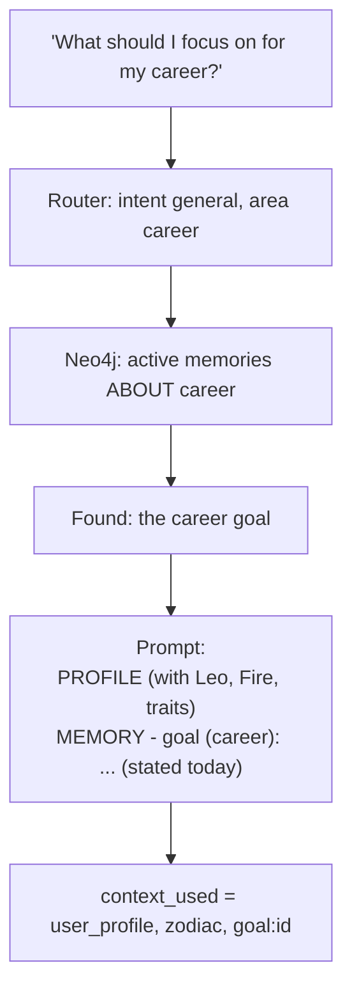

| | |
|---|---|
| **Test** | `test_scenario_3_a_stored_memory_is_retrieved_for_a_related_question` |
| **Input** | A career goal exists. The user asks "What should I focus on for my career?" |
| **Expected** | `context_used` is exactly `["user_profile", "zodiac", "goal:<id>"]`. The prompt contains the line `- goal (career): Career goal: plans to switch jobs in 2027. (stated today)`, the name, and `Sun sign: Leo (Fire) - traits: confident, generous, expressive` |
| **Actual** | Passed |
| **Live** | `context_used: ["user_profile", "zodiac", "history", "goal:13201797-..."]`. The reply said: "For your job switch in 2027, prepare a simple 'spotlight pitch'..." |

---

### Scenario 4: Follow-up question

This scenario tests **short-term context**. The important detail: a follow-up must explain the previous answer, so it must use the same memories the previous answer used, not run a new search.

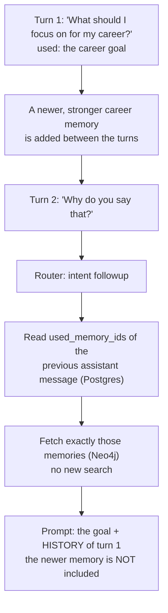

| | |
|---|---|
| **Test** | `test_scenario_4_a_follow_up_reuses_the_previous_turns_memories` |
| **Input** | Turn 1: a career question. Then a new career memory ("was just promoted to team lead", confidence 1.0, importance 1.0) is added. Turn 2: "Why do you say that?" |
| **Expected** | Turn 2's `context_used` is `["user_profile", "zodiac", "history", "goal:<same id>"]`. The prompt contains the first question and the first reply under `[HISTORY]`. The prompt does **not** contain "promoted to team lead" |
| **Actual** | Passed |
| **Live** | `context_used: ["user_profile", "zodiac", "history", "goal:13201797-..."]`. The reply began: "I'm saying that because what you've shared points to..." and referred back to the job switch |

Related tests on short-term context:

| Test | Expected | Actual |
|---|---|---|
| `test_history_is_limited_to_the_last_six_messages_of_this_session` | Only the last 6 messages are sent, and none from another session | Passed |
| `test_first_message_has_no_history_block_or_label` | The first message has no `[HISTORY]` block and no `history` label | Passed |
| `test_get_recent_returns_only_the_last_messages_oldest_first` | The window is the newest N, in reading order | Passed |
| `test_get_recent_never_crosses_into_another_session` | History never leaks between sessions | Passed |
| `test_followup_without_a_previous_reply_is_treated_as_general` | A follow-up with nothing to follow is handled, and recorded, as a general question | Passed |
| `test_followup_skips_a_memory_deleted_since` | A memory deleted between the two turns is left out | Passed |

---

### Scenario 5: New session using previous information

This scenario tests **long-term memory**: what survives when the conversation does not.

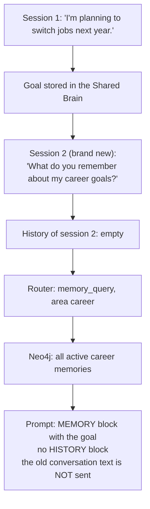

| | |
|---|---|
| **Test** | `test_scenario_5_a_new_session_uses_what_was_remembered_earlier` |
| **Input** | Session 1 stores the goal. A new session asks "What do you remember about my career goals?" |
| **Expected** | `context_used` is `["user_profile", "zodiac", "goal:<id>"]` with no `history`. The prompt contains the goal's sentence. The prompt does **not** contain the original message text from session 1: only the distilled memory crosses sessions |
| **Actual** | Passed |
| **Live** | In a new session, `context_used: ["user_profile", "zodiac", "goal:13201797-..."]`. Reply: "You've told me that your career goal is to switch jobs in 2027. That's the only career-goal detail I have saved so far." |

Related tests:

| Test | Expected | Actual |
|---|---|---|
| `test_memory_query_returns_everything_in_the_area_newest_first_without_astrology` | A memory question lists every memory in the area, newest first, and uses the plain "tell them what you remember" persona | Passed |
| `test_memory_query_about_everything_returns_all_areas` | "What do you know about me?" returns memories from all areas | Passed |

---

### Scenario 6: Irrelevant memory

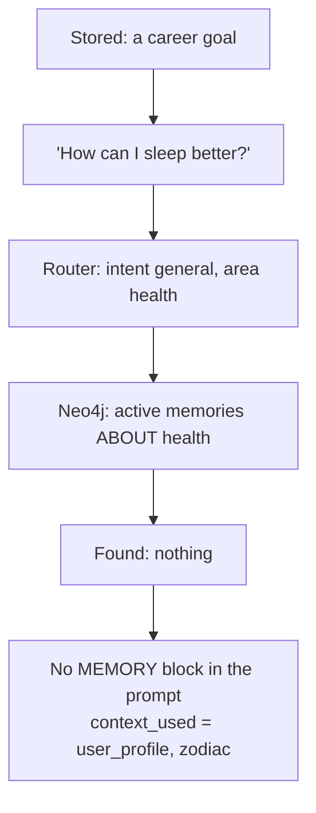

| | |
|---|---|
| **Test** | `test_scenario_6_an_irrelevant_memory_is_not_included` |
| **Input** | A career goal exists. The user asks "How can I sleep better?" |
| **Expected** | The goal's id is not in `context_used`. The prompt has no `[MEMORY]` block and does not contain the goal's text |
| **Actual** | Passed |
| **Live** | "Any advice for my health this month?" returned `context_used: ["user_profile", "zodiac", "history"]`. The career goal was not sent |

Related tests on what is and is not selected:

| Test | Expected | Actual |
|---|---|---|
| `test_general_ranks_by_confidence_importance_and_recency_and_keeps_top_k` | With more memories than fit, the top 5 by score are sent, in score order | Passed |
| `test_general_uses_every_routed_area` | A message about two areas gets memories from both | Passed |
| `test_superseded_memories_are_never_selected` | A replaced memory is never sent | Passed |
| `test_general_with_no_area_falls_back_to_the_three_most_important` | A vague question gets the 3 most important memories | Passed |
| `test_general_area_with_its_own_memories_uses_those` | If something is stored under `general`, that is used and the fallback is not | Passed |
| `test_profile_query_sends_profile_and_zodiac_only` | "What is my sign?" sends no memories | Passed |
| `test_smalltalk_sends_only_the_name_and_the_last_two_messages` | "Thanks!" sends the name and two messages, nothing else | Passed |
| `test_one_user_never_gets_another_users_memories` | Another user's memory in the same area is never sent | Passed |

---

### Scenario 7: User correcting existing information

There are two kinds of correction: correcting a memory, and correcting the profile.

**7a. Correcting a memory**

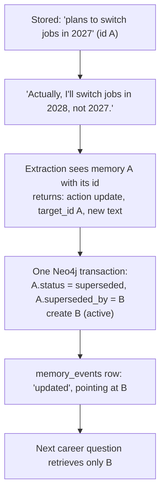

| | |
|---|---|
| **Test** | `test_scenario_7_correcting_a_memory_supersedes_the_old_one` |
| **Expected** | Two nodes exist. The old one has status `superseded` and `superseded_by` set to the new id. The new one is `active`, with text "...in 2028" and `target_year: 2028`. The audit row says `updated` and points at the new node. A later career question has only the new goal in `context_used`, and "2027" does not appear in the `[MEMORY]` block |
| **Actual** | Passed |
| **Live** | "Actually, I've pushed the job switch to 2028." gave `{"action": "updated", "kind": "goal", "title": "Job switch timing updated"}`. Asking again returned: "you're planning to switch jobs in 2028. That's the only career-goal detail I have saved so far." |

**7b. Correcting the profile**

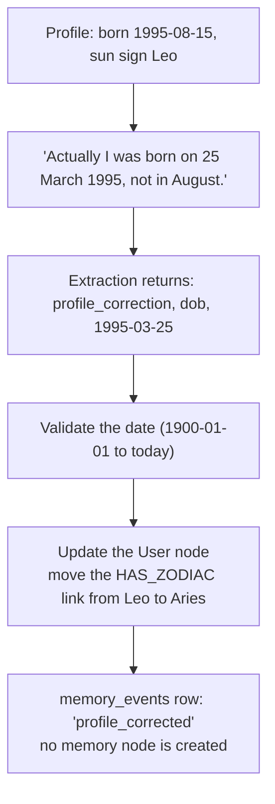

| | |
|---|---|
| **Test** | `test_scenario_7_correcting_the_profile_updates_the_user_and_the_zodiac` |
| **Expected** | The date of birth is 1995-03-25. The sun sign is Aries, and there is exactly one zodiac link. `profile_updated_via` is `chat`. The name is unchanged. No memory node is created. The poll returns one update "Date of birth updated" |
| **Actual** | Passed |
| **Live** | Covered by browser test E15: correcting a detail in chat shows a "Profile updated" chip and the Profile page shows the new value |

Related tests on corrections:

| Test | Expected | Actual |
|---|---|---|
| `test_birth_time_correction_marks_the_time_as_known` | Giving a birth time in chat also sets "birth time known" | Passed |
| `test_update_cannot_touch_another_users_memory` | An update naming another user's memory id is dropped | Passed |
| `test_invalid_items_are_dropped_and_valid_ones_still_applied` | A bad item (unknown life area, invalid date, score out of range) is dropped; the good items in the same reply are kept | Passed |
| `test_skip_items_store_nothing` | A fact already stored is not stored twice | Passed |
| `test_deleting_a_memory_does_not_revive_the_one_it_superseded` | Deleting the new memory does not bring the old one back | Passed |

---

### Scenario 8: Missing user information

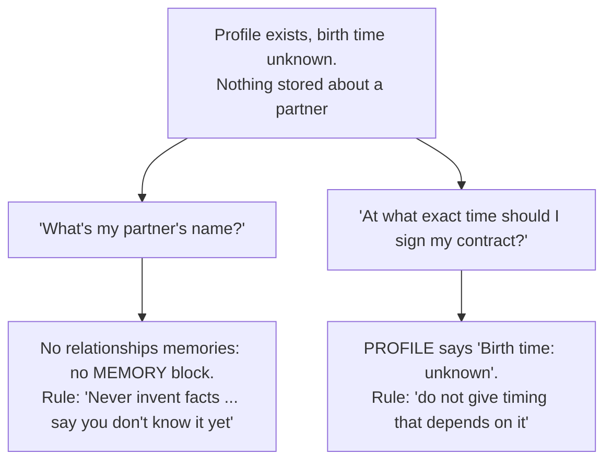

| | |
|---|---|
| **Test** | `test_scenario_8_missing_information_is_marked_unknown_not_invented` |
| **Expected (partner)** | `context_used` is `["user_profile", "zodiac"]`. No `[MEMORY]` block. The prompt contains "Never invent facts about the user" and "say that you don't know it yet" |
| **Expected (timing)** | The prompt contains `Birth time: unknown` and the rule not to give timing that depends on it |
| **Actual** | Passed |
| **Live** | For the user whose profile came from chat (no birth time), the reply ended: "If you share your birth time, I can tailor this even more." |

Related tests:

| Test | Expected | Actual |
|---|---|---|
| `test_partial_profile_from_chat_is_used_and_still_nudges` | A profile with only a name is used as far as it goes, and the user is still nudged to complete it | Passed |
| `test_unknown_birth_time_is_stored_as_unknown` | Ticking "I don't know my birth time" stores no time | Passed |
| `test_memory_page_for_a_new_user_is_empty` | A new user's memory page is empty, not an error | Passed |

## 4. All other backend tests

### 4.1 By file

| File | Tests | What it covers |
|---|---|---|
| `test_chat.py` | 37 | The chat pipeline: scenarios 1, 3, 4, 6, 8; request and response shape; retrieval per intent; ranking; the prompt; saving; failures |
| `test_memory.py` | 26 | The memory task: scenarios 2, 5, 7; the gate; storing; corrections; failures; polling; the memory page; deleting |
| `test_classifier.py` | 31 | Jev, the LLM classifier, the keyword rules, and the fallback chain |
| `test_profile.py` | 30 | The sun-sign stub; saving and validating the profile; isolation |
| `test_auth.py` | 15 | Signup, login, tokens, the two-store signup |
| `test_sessions.py` | 14 | Creating and listing chats; message order; ownership; the history window |
| `test_llm.py` | 10 | Primary and fallback model; JSON validation; provider chosen by settings |
| `test_scaffolding.py` | 5 | The migration creates the tables; Neo4j seeding is complete and repeatable |
| `test_rate_limit.py` | 4 | The limit, per user, on `/chat` only |
| `test_health.py` | 3 | Health with both stores up, Neo4j down, Postgres down |
| **Total** | **175** | |

### 4.2 The memory gate

| Test | What it does | Expected | Actual |
|---|---|---|---|
| `test_memory_gate_marks_low_scoring_messages_as_skipped` | A message with durable-fact score 0.1 | Message status `skipped` | Passed |
| `test_gate_skip_never_calls_the_extraction_llm` | Same | The extraction LLM is never called | Passed |
| `test_memory_gate_can_be_switched_off` | `MEMORY_GATE_ENABLED=false`, low score | Extraction runs anyway | Passed |
| `test_a_message_with_nothing_worth_storing_ends_as_done_with_no_updates` | The gate passes but extraction returns nothing | Status `done`, no updates, no nodes | Passed |

### 4.3 Storing

| Test | Expected | Actual |
|---|---|---|
| `test_each_kind_gets_its_own_label_and_relationship` | goal → `Goal` / `HAS_GOAL`; interest → `Interest` / `INTERESTED_IN`; preference → `Preference` / `PREFERS`; memory → `Memory` / `HAS_MEMORY` | Passed |
| `test_both_messages_are_saved_with_their_fields` | The user and assistant messages are saved with intent, areas, context used and memory ids | Passed |
| `test_session_title_comes_from_the_first_message_only` | The title is set once, from the first message | Passed |

### 4.4 The router

| Group | Tests | What is proven |
|---|---|---|
| Jev | 6 | One call asks one multiple-choice question and one yes/no question per area. Areas below the threshold are dropped. No area means `general`. Only the last 3 messages are sent. The model version is pinned, the timeout is set, retries are off |
| LLM classifier | 4 | JSON is mapped to a route. Areas the LLM invents are dropped. An unknown intent is rejected |
| Keyword rules | 10 cases | Each intent and area is recognised from sample sentences |
| The chain | 7 | Jev is used when confident. The LLM is asked when Jev is unsure, fails or times out. Rules are used when the LLM fails too |
| Settings | 4 | `CLASSIFIER=jev` or `llm` decides the chain. A missing key starts without Jev. An unknown value is rejected |

### 4.5 Keeping users apart

| Test | Expected | Actual |
|---|---|---|
| `test_another_users_session_returns_404_and_saves_nothing` | Chatting in someone else's session gives 404 and saves nothing | Passed |
| `test_user_id_in_the_body_is_ignored` | A `user_id` in the request body cannot be used to act as another user | Passed |
| `test_one_user_never_gets_another_users_memories` | Retrieval never crosses users | Passed |
| `test_users_only_see_their_own_sessions` | The chat list is per user | Passed |
| `test_missing_session_looks_the_same_as_another_users_session` | Both give the same 404, so ids reveal nothing | Passed |
| `test_users_only_see_their_own_memories_on_the_memory_page` | The memory page is per user | Passed |
| `test_a_user_cannot_delete_another_users_memory` | 404, and the memory still exists | Passed |
| `test_polling_is_limited_to_the_users_own_user_messages` | Polling someone else's message gives 404 | Passed |
| `test_each_user_sees_only_their_own_profile` | Profiles are per user | Passed |

Failure tests are listed in [error-handling.md](error-handling.md).

## 5. Browser tests

70 Playwright tests drive a real browser through the real frontend, backend, databases and model. They cover every path a user can take.

| Group | Tests | Examples |
|---|---|---|
| A. Access and routing | 14 | A logged-out visitor is sent to login. A user who has not onboarded is sent to onboarding. A broken token logs the user out |
| B. Signup | 5 | Signing up leads to onboarding. A registered email shows an error. A short password is stopped |
| C. Login and logout | 8 | Login survives a reload. A wrong password and an unknown email show the same error. A slow login shows "Connecting…" |
| D. Onboarding | 7 | Known and unknown birth time. A future date of birth is refused. A blank name is refused with a readable message |
| E. Chat | 20 | Send with Enter. A follow-up gets an answer. New chat and switching back. A lasting fact shows a "Memory updated" chip. An ordinary question shows no chip. A later question uses the remembered fact. A correction shows "Profile updated". The rate-limit message. A late reply does not appear in the wrong chat |
| F. Memory page | 5 | A remembered fact appears under its life area. Cancelling a delete keeps it; confirming removes it |
| G. Profile | 5 | Changing the date of birth changes the sun sign. An invalid edit saves nothing |
| H. Navigation and layout | 4 | Back and forward. Phone layout. Long replies scroll |
| I. Keeping users apart | 2 | One user never sees another's chats or memories |

Writing these tests found three bugs, which were fixed: a chat address that belonged to someone else stayed on "Loading chat"; the Profile page showed an old value after a correction in chat; a reply that arrived after the user switched chats appeared in the wrong chat.

## 6. Results with a real model

The assignment's example conversation was run by hand against the application with a real model. The full requests and responses are in [api-samples.md](api-samples.md).

| # | Message | `context_used` | Memory step | Good? |
|---|---|---|---|---|
| 1 | I'm planning to switch jobs next year. | profile, zodiac | Created goal "Job switch next year", stored as 2027 | Yes |
| 2 | What should I focus on for my career? | profile, zodiac, history, goal | Skipped by the gate | Yes: the reply mentions the 2027 switch |
| 3 | Why do you say that? | profile, zodiac, history, goal | | Yes: explains the previous reply |
| 4 | Any advice for my health this month? | profile, zodiac, history | | Yes: the career goal is not sent |
| 5 | Thanks! | profile (name only), history | | Partly: see below |
| 6 | *(new chat)* What do you remember about my career goals? | profile, zodiac, goal | | Yes: recalls the goal with no history |
| 7 | What is my zodiac sign? | profile, zodiac, history | | Yes: "Leo (Fire)" |
| 8 | Actually, I've pushed the job switch to 2028. | profile, zodiac, history, old goal | Updated: old goal superseded | Yes |
| 9 | What do you remember about my career goals? | profile, zodiac, history, new goal | | Yes: says 2028 only |
| 10 | I'm preparing for a product management interview next month. | profile, zodiac, history, goal | Created goal "Prepare for PM interview" | Yes |

**What the live run showed that the automated tests cannot:**

- **Context selection worked in all ten turns.** The right context was chosen every time.
- **The small model sometimes says more than it should.** After "Thanks!" (turn 5) only the name and two messages were sent, which is correct, but the model repeated its health advice instead of a short "you're welcome". For a new user with no profile, the model was correctly told not to name a sign and did not, yet it still described a "grounded" personality that nothing supported. These are weaknesses of the cheapest model, which was chosen to keep costs down. They are the kind of thing the evaluation in the next section is meant to measure, and a stronger model or a stricter rule would be the fix.

## 7. Evaluating the Shared Brain

The question: **does the Shared Brain make the answers better?** A sophisticated framework is not needed. What is needed is a small fixed set of conversations, a few numbers, and one comparison.

### 7.1 The main comparison: on versus off

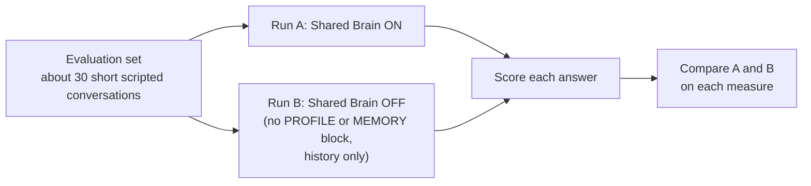

Each scripted conversation has a setup ("the user said X in an earlier session"), a question, and the facts a good answer should and should not use. Because every reply already stores `context_used`, `used_memory_ids`, `route_intent` and `route_areas`, most of the numbers can be computed from the database without reading any reply.

### 7.2 One measure for each area

| Area | Question it answers | How to measure | Example |
|---|---|---|---|
| **Memory accuracy** | Do we store the right facts, correctly? | A labeled list of messages, each marked "should store X" or "should store nothing". Compare with what the extraction step produced. Report precision (of what we stored, how much was right) and recall (of what we should have stored, how much we did) | "I'm planning to switch jobs next year" should give one career goal with `target_year` 2027. "What should I focus on?" should give nothing |
| **Context relevance** | Do we send the memories that matter? | For each question, a person marks which stored memories are relevant. Compare with `used_memory_ids`. Report precision and recall of retrieval | For a career question with one career goal and one health interest stored, only the career goal should be used |
| **Irrelevant context** | Do we send things that do not matter? | The share of sent memories that the labeler marked irrelevant. Lower is better. Also count turns where a memory was sent for small talk (should be zero) | A health question that receives a career goal counts against this |
| **Personalization** | Does the answer actually use what we know? | An LLM judge (or a person) scores each answer from 1 to 5 on "does this answer use the user's known facts correctly?". Compare run A with run B | With the brain on, "focus on your 2027 job switch" should score higher than a generic answer |
| **Conversation consistency** | Does the assistant contradict itself or the stored facts? | For each answer, a judge checks it against the stored facts and the last 6 messages and marks any contradiction. Report the contradiction rate. Include corrections: after "it's 2028 now", does any later answer still say 2027? | After a correction, the rate of answers using the old value should be zero |
| **Memory persistence** | Does a fact survive into a new session? | Store a fact in session 1. In a new session, ask about it. Report the share of facts recalled correctly. Repeat after simulated days to check decay does not hide important facts | "What do you remember about my career goals?" in a new chat should return the goal |

### 7.3 A small worked example

Suppose the evaluation set has 30 messages for memory accuracy: 12 should create a memory and 18 should not.

| | Should store | Should not store |
|---|---|---|
| **Stored** | 11 | 2 |
| **Not stored** | 1 | 16 |

- Precision = 11 / (11 + 2) = 85%. Two messages were stored that should not have been.
- Recall = 11 / (11 + 1) = 92%. One lasting fact was missed.

These two numbers point at different fixes. Low precision means the gate threshold is too low or the extraction prompt is too eager. Low recall means the gate is closing on real facts. The settings `MEMORY_GATE_THRESHOLD` and `MEMORY_GATE_ENABLED` exist so this can be tuned and re-measured.

### 7.4 What is already available for evaluation

| Already built | How it helps |
|---|---|
| `context_used` and `used_memory_ids` saved on every reply | Retrieval can be scored without reading replies |
| `route_intent` and `route_areas` saved on every reply | Router mistakes can be found and counted |
| `memory_status` on every user message, and the `memory_events` table | The gate's pass rate and every memory write can be counted |
| Tracing of each turn and each memory task | Any single bad answer can be opened and inspected step by step |
| `FakeLLM` and the classifier interface | The same evaluation set can be replayed with a different model or router |
| Feature settings (`CLASSIFIER`, gate threshold, top K, decay) | One setting can be changed and the numbers compared |

### 7.5 Product signals, once there are real users

- How often a user deletes a memory from the Memory page (a sign of a wrong or unwanted memory).
- How often a user corrects a memory in chat.
- Whether users return to earlier topics in new sessions.

## 8. Known limits of the tests

- The backend tests use a fake LLM, so they do not measure the quality of the wording. That is by design; quality is the job of the evaluation in section 7.
- The browser tests use a real model, so each test allows one retry for an occasional slow or unusual answer.
- The evaluation in section 7 is a plan. The data it needs is already recorded, but the evaluation set and the scoring script are not built.
- There is no load test.
